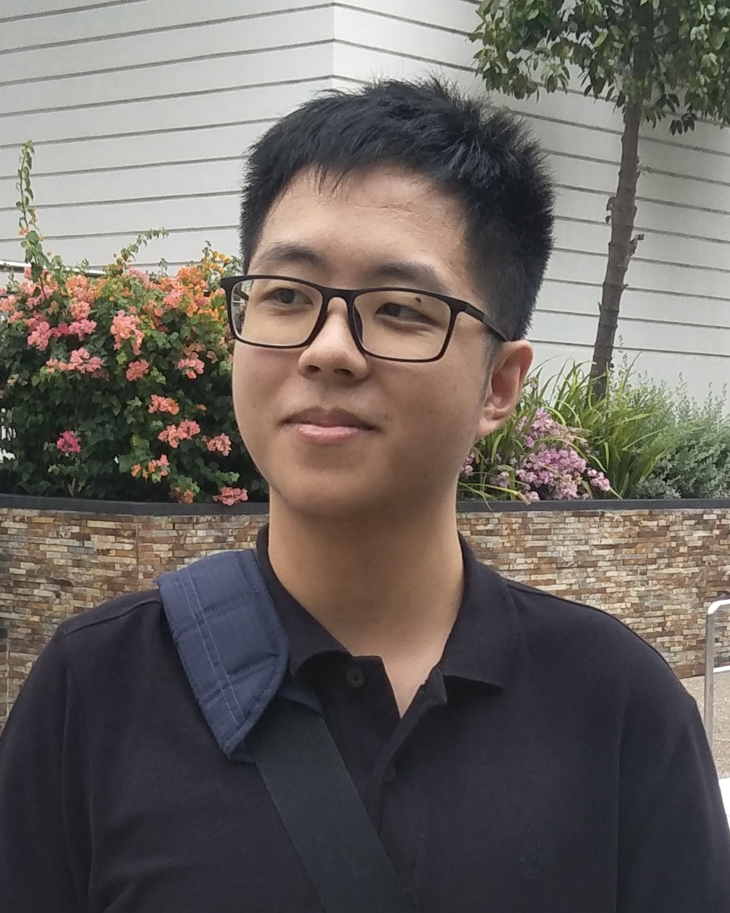

We are a team based in the [School of Computing, National University of Singapore](http://www.comp.nus.edu.sg).

You can reach us at the email <ay2021s1-cs2103t-w16-3@googlegroups.com>

## Project team

### Ian Yong

[[github](https://github.com/ianyong)]
[[portfolio](team/ianyong.md)]

* Role: Team Co-Lead
* Responsibilities: Testing

### Tan Wei Liang

[[github](http://github.com/wltan)]
[[portfolio](team/wltan.md)]

* Role: Team Co-Lead
* Responsibilities: Git/CI Expert, Integration

### Johnny Doe

[[github](http://github.com/johndoe)] [[portfolio](team/johndoe.md)]

* Role: Developer
* Responsibilities: Data

### Jean Doe

[[github](http://github.com/johndoe)]
[[portfolio](team/johndoe.md)]

* Role: Developer
* Responsibilities: Dev Ops + Threading

### James Doe

[[github](http://github.com/johndoe)]
[[portfolio](team/johndoe.md)]

* Role: Developer
* Responsibilities: UI
