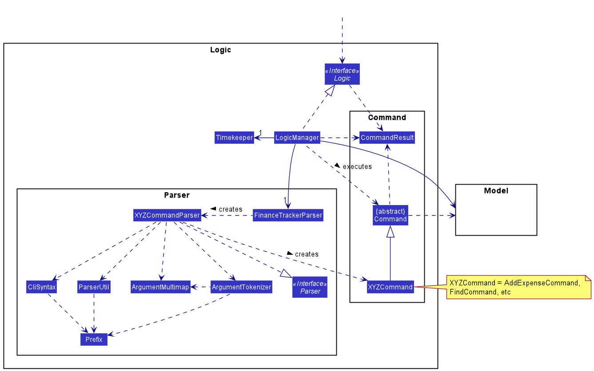
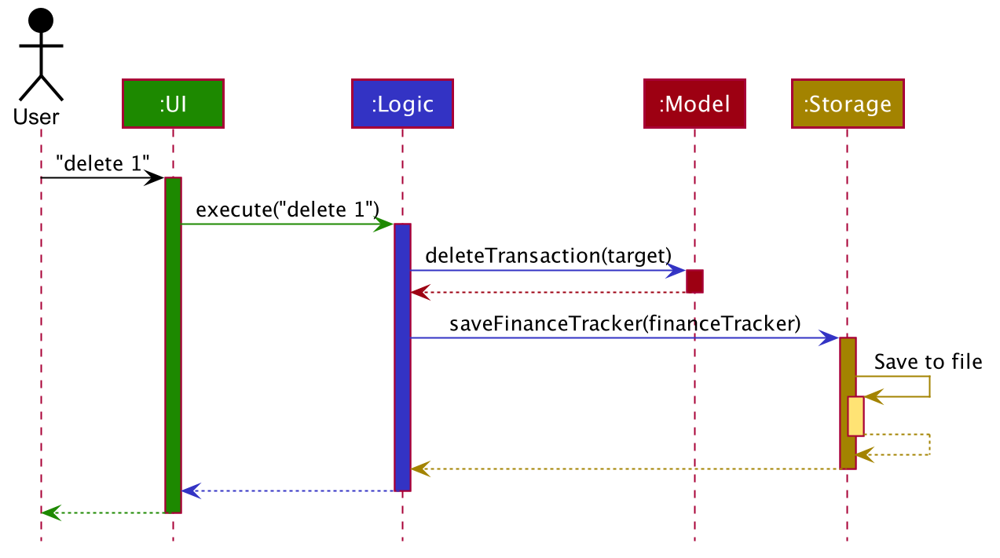
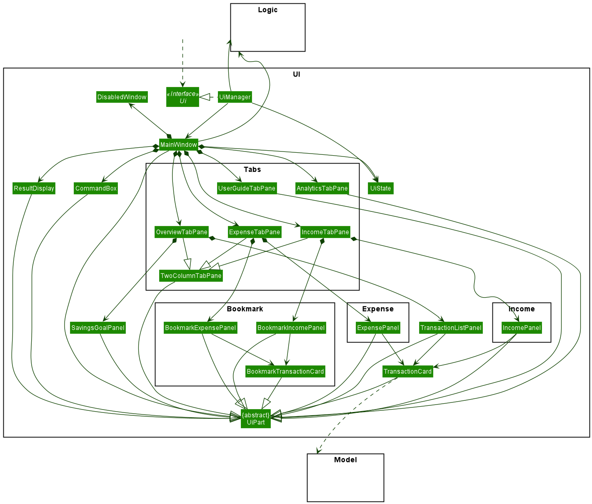
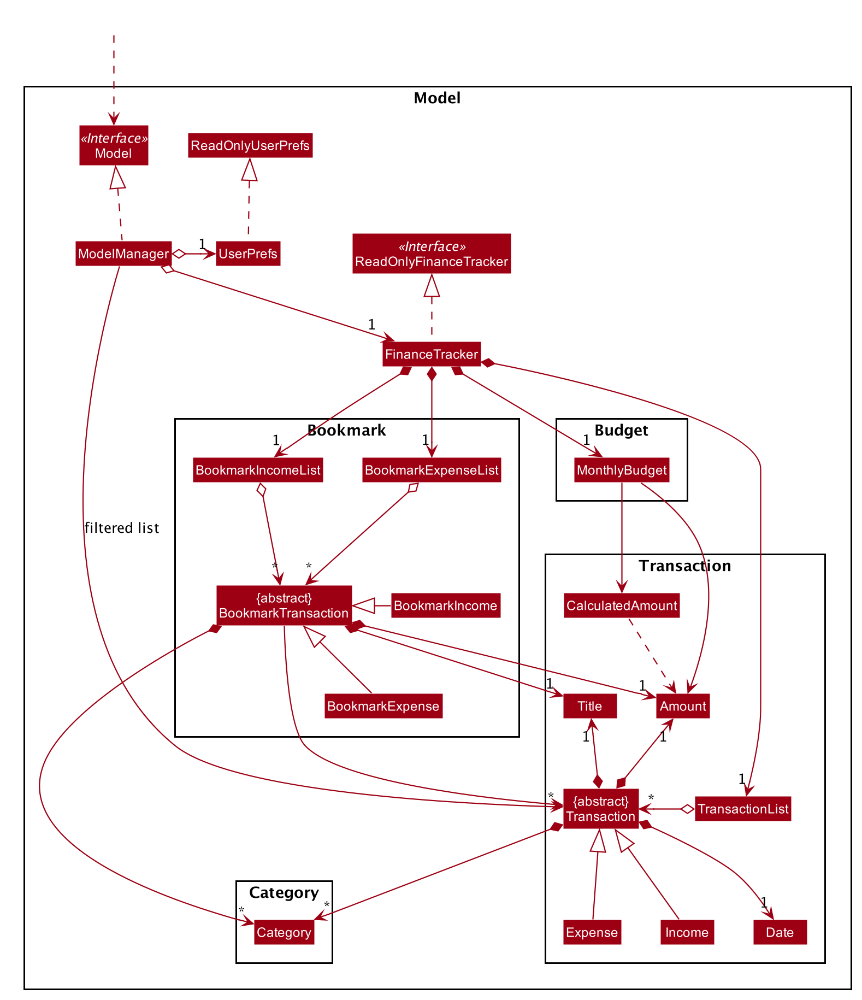
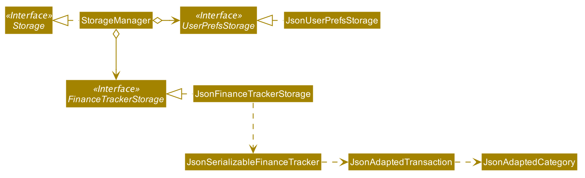

* Table of Contents
{:toc}

--------------------------------------------------------------------------------------------------------------------

## **Setting up, getting started**

Refer to the guide [_Setting up and getting started_](SettingUp.md).

--------------------------------------------------------------------------------------------------------------------

## **Design**

### Architecture

The ***Architecture Diagram*** given above explains the high-level design of the App. Given below is a quick overview of each component.

**`Main`** has two classes called [`Main`](https://github.com/AY2021S1-CS2103T-W16-3/tp/blob/master/src/main/java/ay2021s1_cs2103_w16_3/finesse/Main.java) and [`MainApp`](https://github.com/AY2021S1-CS2103T-W16-3/tp/blob/master/src/main/java/ay2021s1_cs2103_w16_3/finesse/MainApp.java). It is responsible for:
* on app launch - initializing the components in the correct sequence, and connecting them to each other.
* on shut down - shutting down the components and invoking cleanup methods where necessary.

[**`Commons`**](#common-classes) represents a collection of classes used by multiple other components.

The rest of the App consists of four components.

* [**`UI`**](#ui-component): The App's User Interface.
* [**`Logic`**](#logic-component): The command executor.
* [**`Model`**](#model-component): Holds the data of the App in memory.
* [**`Storage`**](#storage-component): Reads data from, and writes data to, the hard disk.

Each of the four components:

* defines its *API* in an `interface` with the same name as the Component.
* exposes its functionality using a concrete `{Component Name}Manager` class (which implements the corresponding API `interface` mentioned in the previous point.

For example, the `Logic` component (see the class diagram given below) defines its API in the `Logic.java` interface and exposes its functionality using the `LogicManager.java` class which implements the `Logic` interface.

**How the architecture components interact with each other**

The *Sequence Diagram* below shows how the components interact with each other for the scenario where the user issues the command `delete 1`.

The sections below give more details of each component.

### UI component

**API** :
[`Ui.java`](https://github.com/AY2021S1-CS2103T-W16-3/tp/blob/master/src/main/java/ay2021s1_cs2103_w16_3/finesse/ui/Ui.java)

The UI consists of a `MainWindow` that is made up of parts e.g.`CommandBox`, `ResultDisplay`, `TransactionListPanel`, `StatusBarFooter` etc. All of these, including `MainWindow`, inherit from the abstract `UiPart` class.

The `UI` component uses the JavaFx UI framework. The layout of these UI parts is defined in matching `.fxml` files that are in the `src/main/resources/view` folder. For example, the layout of [`MainWindow`](https://github.com/AY2021S1-CS2103T-W16-3/tp/blob/master/src/main/java/ay2021s1_cs2103_w16_3/finesse/ui/MainWindow.java) is specified in [`MainWindow.fxml`](https://github.com/AY2021S1-CS2103T-W16-3/tp/blob/master/src/main/resources/view/MainWindow.fxml).

The `UI` component:

* executes user commands using the `Logic` component.
* listens for changes to `Model` data so that the UI can be updated with the modified data.

### Logic component

**API** :
[`Logic.java`](https://github.com/AY2021S1-CS2103T-W16-3/tp/blob/master/src/main/java/ay2021s1_cs2103_w16_3/finesse/logic/Logic.java)

1. `Logic` uses the `FinanceTrackerParser` class to parse the user command.
1. This results in a `Command` object which is executed by `LogicManager`.
1. The command execution can affect `Model` (e.g. adding a transaction).
1. The result of the command execution is encapsulated as a `CommandResult` object which is passed back to `Ui`.
1. In addition, the `CommandResult` object can also instruct `Ui` to perform certain actions, such as displaying the help message to the user.

Below is the Sequence Diagram for interactions within the `Logic` component for the `execute("delete 1")` API call.

:information_source: **Note:** The lifeline for `DeleteCommandParser` should end at the destroy marker (X) but due to a limitation of PlantUML, the lifeline reaches the end of diagram.

### Model component

**API** : [`Model.java`](https://github.com/AY2021S1-CS2103T-W16-3/tp/blob/master/src/main/java/ay2021s1_cs2103_w16_3/finesse/model/Model.java)

The `Model`:

* stores a `UserPref` object that represents the user’s preferences.
* stores the finance tracker data in a `TransactionList` containing `Transaction`s.
* exposes `MonthlySavings` and `MonthlyBudget`, which can be 'observed' e.g. the UI can be bound to the values in these classes so that the UI automatically updates when the values in the classes change.
* exposes an unmodifiable `ObservableList<Transaction>` which can be 'observed' e.g. the UI can be bound to this list so that the UI automatically updates when the data in the list changes.
* does not depend on any of the other three components (`UI`, `Logic`, `Storage`).

A `Transaction`:
* represents a unit of user data within the finance tracker.
* is either an `Expense` or an `Income`.
* is composed of a `Title`, an `Amount`, a `Date`, and any number of `Category`s. These are known as *data fields*.

The *data fields* `Title`, `Amount`, `Date`, and `Category` are encapsulations of an underlying Java data type.

| Data Field  | Underlying Java Data Type   |
| ----------- | -------------------------   |
| `Title`     | `java.lang.String`          |
| `Amount`    | `java.math.BigDecimal`      |
| `Date`      | `java.time.LocalDate`       |
| `Category`  | `java.lang.String`          |

The underlying Java data types allow more operations to be done on `Transaction` objects, such as filtering transactions by date, or aggregating the amounts of expenses and incomes.

:information_source:
**Note:** All data fields take in a `String` in their constructor, regardless of the underlying Java data type.
Within the constructor, data validation takes place to ensure that the `String` correctly represents a valid data field.
If the `String` given is not valid, an `IllegalArgumentException` will be thrown.
Otherwise, the `String` is parsed into the underlying Java data type.  
The reason for this is that when a data field object needs to be created, it is generally from a `String`
(such as when a user command parsed from the `Logic` component, or when a transaction is loaded from the `Storage` component).
This abstraction is maintained so that the implementation of other components (`Logic` and `Storage`) is independent of
the underlying Java data type choices in the `Model` component.

### Storage component

**API** : [`Storage.java`](https://github.com/AY2021S1-CS2103T-W16-3/tp/blob/master/src/main/java/ay2021s1_cs2103_w16_3/finesse/storage/Storage.java)

The `Storage` component:

* can save `UserPref` objects in json format and read it back.
* can save the finance tracker data in json format and read it back.

### Common classes

Classes used by multiple components are in the `ay2021s1_cs2103_w16_3.finesse.commons` package.

--------------------------------------------------------------------------------------------------------------------

## **Implementation**

This section describes some noteworthy details on how certain features are implemented.

### Find transactions

The find transactions feature is implemented via `FindCommandParser`, as well as the following commands:

* `FindCommand`, the base command that is returned when the command is parsed
* `FindTransactionCommand`, to be executed when the user inputs the command on the Overview tab
* `FindExpenseCommand`, to be executed when the user inputs the command on the Expenses tab
* `FindIncomeCommand`, to be executed when the user inputs the command on the Incomes tab

`FindCommandParser` takes in the command arguments and parses them to return a `FindCommand` containing the correct predicate for finding the transactions.
Depending on the UI tab the user inputted the command in, a `FindXXXCommand` (`FindTransactionCommand`, `FindExpenseCommand` or `FindIncomeCommand`) will be created from the base `FindCommand`.
When executed, the `FindXXXCommand` will set the predicate of the respective `FilteredList` in `ModelManager` so that only the transactions matching the keywords will be displayed in the list.

Below is the Sequence Diagram for interactions within the `Logic` and `Model` components when the user inputs the `"find tea"` command while on the Overview tab.

Alternatives considered:

* Having separate command parsers for each tab in which the find command can be input, e.g. `FindTransactionCommandParser`, `FindExpenseCommandParser` and `FindIncomeCommandParser`.

### Set monthly spending limit

The monthly budgeting feature is implemented via `SetExpenseLimitCommand` as well as `MonthlyExpenseLimit`.

[Coming soon]

### Set monthly savings goal

The monthly budgeting feature is implemented via `SetSavingsGoalCommand` as well as `MonthlySavingsGoal`.

[Coming soon]

--------------------------------------------------------------------------------------------------------------------

## **Documentation, logging, testing, configuration, dev-ops**

* [Documentation guide](Documentation.md)
* [Testing guide](Testing.md)
* [Logging guide](Logging.md)
* [Configuration guide](Configuration.md)
* [DevOps guide](DevOps.md)

--------------------------------------------------------------------------------------------------------------------

## **Appendix: Requirements**

### Product scope

**Target user profile**:

* Tertiary student
* Has a need to track everyday expenses/incomes
* Wishes to cultivate good saving habits
* Prefers desktop apps
* Prefers typing to mouse interactions

**Value proposition**: Manage finances and cultivate good financial habits (such as saving) efficiently by typing in CLI commands

### User stories

Priorities: High (must have) - `* * *`, Medium (nice to have) - `* *`, Low (unlikely to have) - `*`

| Priority | As a …​               | I want to …​                  | So that I can…​                                                          |
| -------- | ------------------------ | -------------------------------  | --------------------------------------------------------------------------- |
| `* * *`  | new user                 | see usage instructions           | refer to instructions when I forget how to use the app                      |
| `* * *`  | user                     | add an expense                   |                                                                             |
| `* * *`  | user                     | add an income                    |                                                                             |
| `* * *`  | user                     | view a list of past transactions | keep track of my past expenses/incomes                                      |
| `* * *`  | user                     | edit a transaction               | update expenses/incomes that were entered wrongly                           |
| `* * *`  | user                     | delete a transaction             | remove expenses/incomes that were entered wrongly                           |
| `* * *`  | user                     | group transactions by categories | keep track of my past expenses/incomes across various categories            |
| `* * *`  | user                     | search for transactions          | easily find related expenses/incomes                                        |
| `* *`    | user                     | set a monthly spending limit     | track how much I have left to spend for the month                           |
| `* *`    | user                     | set a monthly saving goal        | cultivate good saving habits                                                |
| `* *`    | user                     | view my saving trends            | better manage my future expenses                                            |

*{More to be added}*

### Use cases

(For all use cases below, the **System** is `Fine$$e` and the **Actor** is the `user`, unless specified otherwise)

**Use case: Delete an expense**

**MSS**

1.  User requests to list expenses
2.  Fine$$e shows a list of expenses
3.  User requests to delete a specific expense
4.  Fine$$e deletes the expense

    Use case ends.

**Extensions**

* 2a. The list is empty.

  Use case ends.

* 3a. The given index is invalid.

    * 3a1. Fine$$e shows an error message.

      Use case resumes at step 2.

*{More to be added}*

### Non-Functional Requirements

1.  Should work on any mainstream OS as long as it has Java `11` or above installed.
2.  Should be able to hold up to 1000 expenses/incomes without a noticeable sluggishness in performance for typical usage.
3.  A user with above average typing speed for regular English text (i.e. not code, not system admin commands) should be able to accomplish most of the tasks faster using commands than using the mouse.
4.  The data should be stored locally and should be in a human-editable text file.
5.  The data should not be stored in a Database Management System (DBMS).
6.  Should not require an installer.
7.  Should not depend on any remote server.

*{More to be added}*

### Glossary

* **Expense**: A single transaction that results in a decrease in cash
* **Income**: A single transaction that results in an increase in cash
* **Mainstream OS**: Windows, Linux, Unix, OS-X
* **Savings**: Net gain (positive) or loss (negative) in cash over a set period of time

--------------------------------------------------------------------------------------------------------------------

## **Appendix: Instructions for manual testing**

Given below are instructions to test the app manually.

:information_source: **Note:** These instructions only provide a starting point for testers to work on;
testers are expected to do more *exploratory* testing.

### Launch and shutdown

1. Initial launch

   1. Download the jar file and copy into an empty folder

   1. Double-click the jar file Expected: Shows the GUI with a set of sample contacts. The window size may not be optimum.

1. Saving window preferences

   1. Resize the window to an optimum size. Move the window to a different location. Close the window.

   1. Re-launch the app by double-clicking the jar file. 
       Expected: The most recent window size and location is retained.

1. _{ more test cases …​ }_

### Deleting a transaction

1. Deleting a transaction while all transactions are being shown

   1. Prerequisites: List all transactions using the `list` command. Multiple transactions in the list.

   1. Test case: `delete 1` 
      Expected: First transaction is deleted from the list. Details of the deleted transaction shown in the status message. Timestamp in the status bar is updated.

   1. Test case: `delete 0` 
      Expected: No transaction is deleted. Error details shown in the status message. Status bar remains the same.

   1. Other incorrect delete commands to try: `delete`, `delete x`, `...` (where x is larger than the list size) 
      Expected: Similar to previous.

1. _{ more test cases …​ }_

### Saving data

1. Dealing with missing/corrupted data files

   1. _{explain how to simulate a missing/corrupted file, and the expected behavior}_

1. _{ more test cases …​ }_
