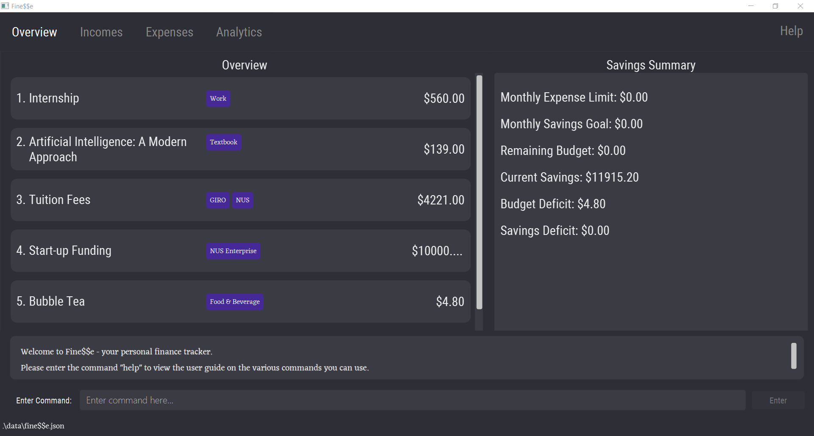
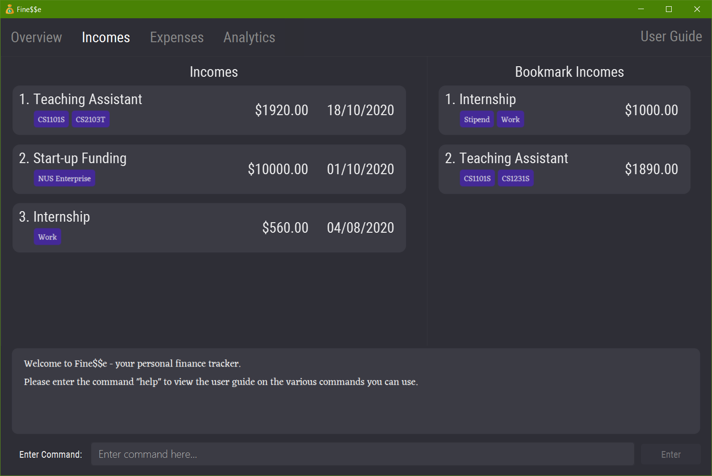
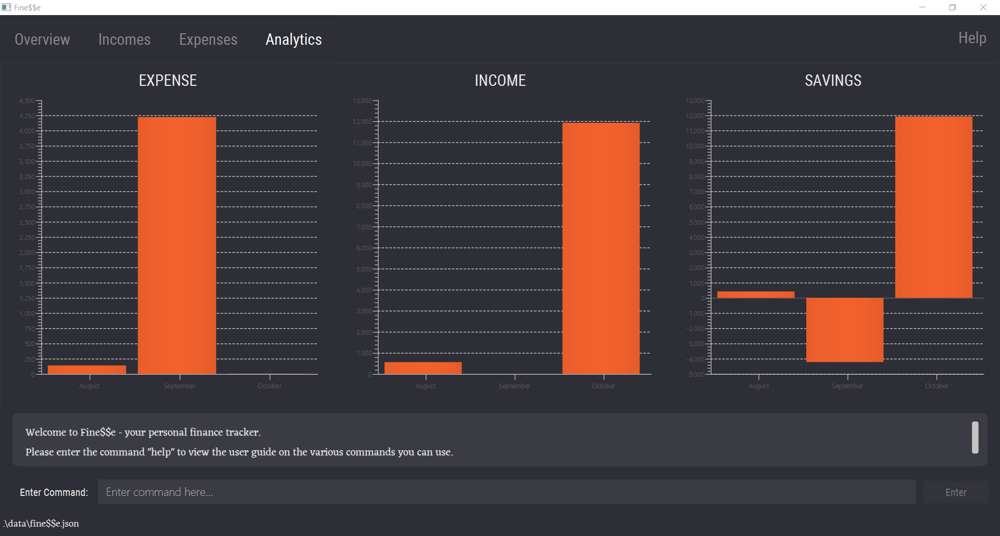

<div class="toc-no-bullet-points">
  * Table of Contents
  {:toc}
</div>

--------------------------------------------------------------------------------------------------------------------
## 1. Introduction

### 1.1 About Fine$$e

Welcome to Fine$$e - your personal finance tracker!

Looking for an all-in-one solution to help you develop good financial habits? Look no further!

Fine\\$\\$e is an integrated platform fully customized for tertiary and university students with the aim of helping you to track your finances effectively.
Fine\\$\\$e allows you to keep track of your incomes, expenses and savings with a few simple commands.
Furthermore, to help you cultivate good financial habits, Fine$$e allows you to budget your finances by setting an expense limit and savings goal, as well as viewing your past spending and saving trends.

Commands can be input easily via the Command Line Interface (CLI), and the information you provide Fine$$e with will be displayed on our sleek Graphical User Interface (GUI).

If you wish to better manage your finances while cultivating good financial habits, then Fine\$\$e is definitely the application for you!

Explore our User Guide to find out more about Fine\$\$e’s amazing features.

### 1.2 Navigating the User Guide

The aim of the User Guide is to provide you with all the necessary information required for you to fully utilize Fine$$e.
We have ensured that the information provided is concise, accessible and easily readable.

Head to [Section 2. "Quick Start"](#2-quick-start) for help on setting up.

[Section 3. "Overview of Features"](#3-overview-of-features) provides a brief overview of Fine\$\$e's myriad of features, while [Section 4. "Features"](#4-features) contains an in-depth breakdown of all the features that Fine\$\$e has to offer.

If you have forgotten the input format for a particular command, fret not as [Section 5. "Command Summary"](#5-command-summary) contains a list of all Fine$$e's command input formats.

A list of the terms used in this user guide as well as their definitions is available in [Section 6. Glossary](#6-glossary).

If you have any questions regarding Fine$$e, do check out [Section 7. FAQ](#7-faq).

Do take note of the following symbols and formatting used throughout this document:

<div markdown="block" class="alert alert-info">

Do take note of the following symbols and formatting used throughout this document:

`Code in code blocks are for user input, Fine$$e data values, or file names.`

:bulb: &nbsp; This is used to indicate useful tips and tricks.

:information_source: &nbsp; This indicates useful information.

:warning: &nbsp; This indicates important information.

</div>

--------------------------------------------------------------------------------------------------------------------
## 2. Quick start

This section contains a step-by-step guide on how to install Fine\\$\\$e and get it to work on your computer.
It also shows the various components that make up Fine\\$\\$e's user interface.


Let's get started!

### 2.1 Installation

1. Ensure you have Java 11 or above installed in your Computer.

1. Download the latest version of `finesse.jar` from [here](https://github.com/AY2021S1-CS2103T-W16-3/tp/releases).

1. Copy the file to the folder you want to use as the *home folder* for Fine$$e.

1. Double-click the file to start the app.
The Fine$$e GUI should appear in a few seconds, with sample data included, similar to the below image.

   

1. Type a command in the command box and press Enter to execute it. e.g. typing `help` and pressing Enter will bring up this user guide.
   Some example commands you can try:

   * `list`: Lists all transactions on the current list.

   * `add-expense t/Bubble Tea a/5 d/03/10/2020 c/Food & Beverage`:
   Adds an expense with the title `Bubble Tea`, amount `$5.00`, date `03/10/2020` and category `Food & Beverage` to the finance tracker.

   * `delete 3`: Deletes the 3rd transaction shown in the current list.

   * `exit`: Exits the app.

### 2.2 Layout of Fine$$e's Interface

The user interface of Fine$$e is divided into 4 tabs, each serving a specific purpose.

#### 2.2.1 Overview Tab

Displays a list of all recent transactions ([incomes](#44-income)/[expenses](#43-expense)), along with your [expense limit](#47-expense-limit), remaining budget, [savings goal](#48-savings-goal) and savings.



#### 2.2.2 Incomes Tab

Displays a list of [incomes](#44-income) and [bookmark incomes](#46-bookmark-income).



#### 2.2.3 Expenses Tab

Displays a list of [expenses](#43-expense) and [bookmark expenses](#45-bookmark-expense).


#### 2.2.4 Analytics Tab

Displays chart visualizations of your monthly expenses, incomes and savings.



--------------------------------------------------------------------------------------------------------------------

## 3. Overview of Features

This section will provide you with a brief overview of Fine\\$\\$e, so that you may get a better sense of Fine\\$\\$e’s basic functionalities before diving into its specific commands.
1.	Manage your incomes and expenses easily
  * Track incomes/expenses by entering their details e.g title, amount, date
  * Categorize your incomes and expenses to better organize your finances
  * Search for incomes/expenses easily by keywords
1. Add bookmarked transactions
  * Save transactions that occur regularly so that frequent expenses/incomes can be added to the finance tracker more conveniently
1. Budgeting
  * Set a monthly expense limit to track your remaining budget for the month
  * Set a monthly savings goal to cultivate good saving habits
1. Analytics
  * View trends in your finances to analyze your spending and saving habits and better plan for the future

--------------------------------------------------------------------------------------------------------------------

## 4. Features

This section aims to provide you with in-depth details on Fine\$\$e's unique features, with relevant examples.

<div markdown="block" class="alert alert-info">

**:information_source: &nbsp; Notes about the command format:**<br>

* Words in `UPPER_CASE` are the parameters to be supplied by the user.<br>
  e.g. in `add-expense t/TITLE`, `TITLE` is a parameter which can be used as `add t/Bubble Tea`.

* Items in square brackets (`[]`) are optional.<br>
  e.g `t/TITLE [c/CATEGORY]` can be used as `t/Bubble Tea c/Food & Beverage` or as `t/Bubble Tea`.

* Items in square brackets, with `...` after the parameter, can be used multiple times (including zero times).<br>
  e.g. `[c/CATEGORY...]` can be used as `c/Food & Beverage`, `c/Food & Beverage c/Tea` etc, or even omitted completely.

* Parameters can be in any order.<br>
  e.g. if the command specifies `t/TITLE a/AMOUNT`, `a/AMOUNT t/TITLE` is also acceptable.

</div>

<div markdown="block" class="alert alert-info">

**:warning: &nbsp; IMPORTANT &nbsp; :warning:**<br>

The formats of the parameters used in the rest of the document are as follows:
* `TITLE` and `CATEGORY` should consist of <abbr title="Alphanumeric characters, space, and the special characters !&quot;#$%&'()*+,-./:;&lt;=&gt;?@[\]^_`{\|}~">printable ASCII characters</abbr>, and cannot begin with a space.
* `AMOUNT`, `AMOUNT_FROM` and `AMOUNT_TO` should be non-negative numbers up to 8 digits with 0 or 2 decimal places, with an optional `$` in front.
* `DATE`, `DATE_FROM` and `DATE_TO` should be in `dd/mm/yyyy` format, and cannot be later than the current date.
* `INDEX` should be a positive integer.

Unless stated otherwise, only one input per parameter is allowed for each command.

</div>

### 4.1 Viewing Help: `help`

Brings up the user guide.

Format: `help`

Example Usage:
```
help
```

Expected Outcome:
```
Opened help window.
```
The user guide is shown in the application.

### 4.2 Switch Tabs: `tab`

Switches the current tab on Fine$$e.

Format: `tab INDEX`
* Switches to the tab corresponding to the specified `INDEX`. For the `tab` command, `INDEX` **must be 1, 2, 3 or 4**.
  * Index 1 switches to the [Overview Tab](#221-overview-tab)
  * Index 2 switches to the [Incomes Tab](#222-incomes-tab)
  * Index 3 switches to the [Expenses Tab](#223-expenses-tab)
  * Index 4 switches to the [Analytics Tab](#224-analytics-tab)

Example:
* `tab 3`

Example Usage:
```
tab 1
```

Expected Outcome:
```
Switched to overview tab.
```
The application switches to the Overview tab.

### 4.3 Expense

An **expense** represents you *paying money for something*.
It could be textbooks for the new semester, that cup of bubble tea you drank the other day, or even taking public transport.

To help you manage your finances, Fine\$\$e records the following information about each of your expenses:
1. **Title**: A descriptive title, to remind you what the expense was about.
1. **Amount**: How much money you paid, to calculate how much you have spent in total.
1. **Date**: The date the payment took place, to track your spending over periods of time.
1. **Categories**: Any number of categories, to help you group related expenses together.

#### 4.3.1 Add Expense: `add-expense`

Adds an expense to the finance tracker.

Format: `add-expense t/TITLE a/AMOUNT [d/DATE] [c/CATEGORY...]`

* `DATE` is optional; if `DATE` is not given, the current date is used.
* `CATEGORY` is optional. Multiple `c/` prefixes can be used to specify multiple categories.

Shortcuts: `adde`; (when on the [Expenses tab](#223-expenses-tab)) `add`

Examples:
* `add-expense t/Starbucks Coffee a/8.90 d/25/10/2020`
* `adde t/Taxi Home from School a/$13 c/Transport c/School`

Example Usage:
```
add-expense t/Bubble Tea a/5 d/03/10/2020 c/Food & Beverage
```

Expected Outcome:
```
New expense added: Bubble Tea Amount: $5.00 Date: 03/10/2020 Categories: [Food & Beverage]
```
Adds a new expense titled `Bubble Tea`, with amount `$5.00`, date `03/10/2020`, and a single category `Food & Beverage`.

#### 4.3.2 Edit Expense: `edit`

Edits an expense in the finance tracker.

Format: (when on the [Expenses tab](#223-expenses-tab)) `edit INDEX [t/TITLE] [a/AMOUNT] [d/DATE] [c/CATEGORY...]`

* `INDEX` allows you to choose which expense to edit by specifying its position in the currently displayed expenses list.
* `TITLE`, `AMOUNT`, `DATE` and `CATEGORY` allow you to specify the expense information to update. None of them are mandatory, but at least one must be specified.
  For parameters that have been omitted, the value will remain unchanged.

> :bulb: &nbsp; To remove all categories from an expense, simply use `c/` with no category name following it.

Examples:
* `edit 2 t/Shopee Internship d/24/10/2020`
* `edit 3 a/$2000 c/`

Example Usage:
```
edit 1 a/5 d/22/09/2020
```

Expected Outcome:
```
Edited Expense: Artificial Intelligence: A Modern Approach Amount: $5.00 Date: 22/09/2020 Categories: [Textbook]
```
Edits the first expense in the currently displayed expenses list to have amount `$5.00` and date `22/09/2020`.
The rest of the expense information remains unchanged.

#### 4.3.3 Delete Expense: `delete`

Deletes the specified expense from the finance tracker.

Format: (when on the [Expenses tab](#223-expenses-tab)) `delete INDEX`

* `INDEX` allows you to choose which expense to delete by specifying its position in the currently displayed expenses list.

Example:
* `delete 1`

Example Usage:
```
delete 3
```

Expected Outcome:
```
Deleted Expense: Bubble Tea Amount: $4.80 Date: 14/10/2020 Categories: [Food & Beverage]
```
Deletes the third expense in the currently displayed expenses list.

#### 4.3.4 List Expense: `ls-expense`

Shows a list of all expenses in the finance tracker.
This effectively resets any current filtering of the expenses list, such as those made by `find`.

Format: `ls-expense`

Shortcuts: `lse`; (when on the [Expenses tab](#223-expenses-tab)) `list`

> :bulb: &nbsp; When on the [Overview tab](#221-overview-tab), you can use `list` to list all transactions.

Example Usage:
```
list
```

Expected Outcome:
```
Listed all expenses.
```
Lists all expenses in the finance tracker.

#### 4.3.5 Find Expense: `find`

Finds expenses that match any of the given keywords, and displays the list of matching expenses.

Format: (when on the [Expenses tab](#223-expenses-tab)) `find KEYWORD [MORE_KEYWORDS...]`

> :bulb: &nbsp; When on the [Overview tab](#221-overview-tab), you can use `find` to search for all transactions (expenses and incomes).

The available keywords and their uses are as follows:

* `t/TITLE`: Searches for all expenses with titles containing the specified `TITLE` keyword.
  * The search is case-insensitive. e.g `taxi` will match `Taxi`
  * More than one keyword can be given.
  * The order of the keywords does not matter. e.g. `Bus Train` will match `Train Bus`
  * Only full words will be matched. e.g. `Snack` will not match `Snacks`
  * Titles matching at least one keyword will be returned (i.e. `OR` search).
    e.g. `Tea Coffee` will return `Bubble Tea`, `Starbucks Coffee`
* `a/AMOUNT`: Searches for all expenses with the specified amount.
* `d/DATE`: Searches for all expenses that occurred on the specified date.
* `c/CATEGORY`: Searches for all expenses labelled with the specified category.
  * The search is case-insensitive. e.g `taxi` will match `Taxi`
  * More than one category can be given; the search will return expenses with any of the input categories.
* `af/AMOUNT_FROM`: Searches for all expenses with amounts more than or equal to the specified amount.
* `at/AMOUNT_TO`: Searches for all expenses with amounts less than or equal to the specified amount.
* `df/DATE_FROM`: Searches for all expenses that occurred on or later than the specified date.
* `dt/DATE_TO`: Searches for all expenses that occurred on or before the specified date.

None of the keywords are mandatory, but at least one must be specified.

Examples:
* `find t/tea d/22/09/2000`
* `find c/Food & drink af/10`

Example Usage:
```
find t/tea t/coffee a/5 df/01/09/2020 dt/30/09/2020
```

Expected Outcome:
```
2 transactions listed!
```
Lists all expenses with titles containing `tea` and/or `coffee`, with amount equal to `$5.00`, in September 2020.

### 4.4 Income

An **income** represents *you receiving money for something*.
It could be your internship allowance, prize money you won from a pitching competition, or even red packets that you receive over Chinese New Year.

To help you manage your finances, Fine\$\$e records the following information about each of your incomes:
1. **Title**: A descriptive title, to remind you what the income was about.
1. **Amount**: How much money you received, to calculate how much you have received in total.
1. **Date**: The date you received the money, to track your income over periods of time.
1. **Categories**: Any number of categories, to help you group related incomes together.

#### 4.4.1 Add Income: `add-income`

Adds an income to the finance tracker.

Format: `add-income t/TITLE a/AMOUNT d/DATE [c/CATEGORY...]`

* `DATE` is optional; if `DATE` is not given, the current date is used.
* `CATEGORY` is optional. Multiple `c/` prefixes can be used to specify multiple categories.

Shortcuts: `addi`; (when on the [Income tab](#222-incomes-tab)) `add`

Examples:
* `add-income t/Waitressing a/80 c/Work`
* `addi t/Angpao money a/$20 d/25/01/2020 c/CNY c/Gift`

Example Usage:
```
add-income t/Shopee Internship a/560 d/03/10/2020 c/Work
```

Expected Outcome:
```
New income added: Shopee Internship Amount: $560.00 Date: 03/10/2020 Categories: [Internship]
```
Adds a new income titled `Shopee Internship`, with amount `$560.00`, date `03/10/2020`, and a single category `Internship`.

#### 4.4.2 Edit Income: `edit`

Edits an expense in the finance tracker.

Format: (when on the [Income tab](#222-incomes-tab)) `edit INDEX [t/TITLE] [a/AMOUNT] [d/DATE] [c/CATEGORY...]`

* `INDEX` allows you to choose which income to edit by specifying its position in the currently displayed incomes list.
* `TITLE`, `AMOUNT`, `DATE` and `CATEGORY` allow you to specify the updated income information. None of them are mandatory, but at least one must be specified.
  For parameters that have been omitted, the value will remain unchanged.

> :bulb: &nbsp; To remove all categories from an income, simply use `c/` with no category name following it.

Examples:
* `edit 2 t/October Allowance c/Allowance`
* `edit 1 a/5 d/22/09/2020`

Example Usage:
```
edit 3 a/$2000 c/
```

Expected Outcome:
```
Edited Income: Teaching Assistant Amount: $2000.00 Date: 18/10/2020 Categories:
```
Edits the third income in the currently displayed incomes list to have amount `$2000.00` and no categories.
The rest of the income information remains unchanged.

#### 4.4.3 Delete Income: `delete`

Deletes the specified income from the finance tracker.

Format: (when on the [Incomes tab](#222-incomes-tab)) `delete INDEX`

* `INDEX` allows you to choose which income to delete by specifying its position in the currently displayed incomes list.

Example:
* `delete 3`

Example Usage:
```
delete 2
```

Expected Outcome:
```
Deleted Income: Teaching Assistant Amount: $1920.00 Date: 18/10/2020 Categories: [CS2103T][CS1101S]
```
Deletes the second income in the currently displayed incomes list.

#### 4.4.4 List Income: `ls-income`

Shows a list of all the incomes in the finance tracker.
This effectively resets any current filtering of the incomes list, such as those made by `find`.

Format: `ls-income`

Shortcuts: `lsi`; (when on the [Incomes tab](#222-incomes-tab)) `list`

> :bulb: &nbsp; When on the [Overview tab](#221-overview-tab), you can use `list` to list all transactions.

Example Usage:
```
list
```

Expected Outcome:
```
Listed all incomes.
```
Lists all incomes in the finance tracker.

#### 4.4.5 Find Income: `find`

Finds incomes that match any of the given keywords, and displays the list of matching incomes.

Format: (when on the [Incomes tab](#222-incomes-tab)) `find KEYWORD [MORE_KEYWORDS...]`

> :bulb: &nbsp; When on the [Overview tab](#221-overview-tab), you can use `find` to search for all transactions (expenses and incomes).

The available keywords and their uses are as follows:

* `t/TITLE`: Searches for all incomes with titles containing the specified `TITLE` keyword.
  * The search is case-insensitive. e.g `work` will match `Work`
  * More than one keyword can be given.
  * The order of the keywords does not matter. e.g. `TA part-time` will match `part-time TA`
  * Only full words will be matched. e.g. `intern` will not match `internship`
  * Titles matching at least one keyword will be returned (i.e. `OR` search).
    e.g. `allowance prize` will return `Laptop Allowance`, `Hackathon Prize`
* `a/AMOUNT`: Searches for all incomes with the specified amount.
* `d/DATE`: Searches for all incomes that occurred on the specified date.
* `c/CATEGORY`: Searches for all incomes labelled with the specified category.
  * The search is case-insensitive. e.g `work` will match `Work`
  * More than one category can be given; the search will return incomes with any of the input categories.
* `af/AMOUNT_FROM`: Searches for all incomes with amounts more than or equal to the specified amount.
* `at/AMOUNT_TO`: Searches for all incomes with amounts less than or equal to the specified amount.
* `df/DATE_FROM`: Searches for all incomes that occurred on or later than the specified date.
* `dt/DATE_TO`: Searches for all incomes that occurred on or before the specified date.

None of the keywords are mandatory, but at least one must be specified.

Examples:
* `find t/allowance d/01/10/2020`
* `find c/angpao at/20`

Example Usage:
```
find c/prize c/gift af/10 at/100
```

Expected Outcome:
```
2 transactions listed!
```
Lists all incomes with the category `prize` and/or `gift`, with amounts between `$10.00` and `$100.00` inclusive.

### 4.5 Bookmark Expense

Fine<span>$</span><span>$</span>e's Bookmark Expense feature is used to store frequent expenses that the user makes such as paying of monthly phone bills or buying bubble tea weekly.
The user will be then be able to edit, delete and convert a bookmarked expense to conveniently add it into Fine<span>$</span><span>$</span>e's expense list.

#### 4.5.1 Add Bookmark Expense: `add-bookmark-expense`

Adds a bookmark expense to the finance tracker.

Format: `add-bookmark-expense t/TITLE a/AMOUNT [c/CATEGORY...]`

Shortcut: `addbe t/TITLE a/AMOUNT [c/CATEGORY...]`

* `CATEGORY` is optional. Multiple `c/` prefixes can be used to specify multiple categories.

Examples:
* `add-bookmark-expense t/Phone Bill a/60 c/Utilities c/Personal`
* `add-bookmark-expense t/Spotify Subscription a/$9 c/Others`
* `addbe t/Bubble Tea a/$4.50 c/Food & Beverage`
* `addbe t/Lunch a/$5.00`

Example Usage:
```
add-bookmark-expense t/Phone Bill a/65 c/Utilities c/Personal
```

Expected Outcome:
```
New bookmark expense added: Phone Bill Amount: $60.00 Categories: [Personal][Utilities]
```
Adds a bookmark expense titled `Phone Bill` with amount `$65.00` and two categories `Utilities` and `Personal`.

#### 4.5.2 Edit Bookmark Expense: `edit-bookmark`

Edits a bookmark expense in the finance tracker.

> :warning: &nbsp; This command can only be executed on the [Expenses tab](#223-expenses-tab).

Format: `edit-bookmark INDEX [t/TITLE] [a/AMOUNT] [c/CATEGORY...]`

* `INDEX` allows you to choose which bookmark expense to edit by specifying its position in the bookmark expenses list.
* `TITLE`, `AMOUNT` and `CATEGORY` allow you to specify the updated bookmark expense information. None of them are mandatory, but at least one must be specified.
  For parameters that have been omitted, the value will remain unchanged.

> :bulb: &nbsp; To remove all categories from a bookmark expense, simply use `c/` with no category name following it.

Examples:
* `edit-bookmark 1 a/65`
* `edit-bookmark 2 t/Part Time a/400 c/Work`
* `edit-bookmark 3 c/Others`

Example Usage:
```
edit-bookmark 2 a/70
```

Expected Outcome:
```
Edited Bookmark Expense: Phone Bill Amount: $70.00 Categories: [Personal][Utilities]
```
Edits the second bookmark expense in the bookmark expenses list to have an amount of `$70.00`.

#### 4.5.3 Delete Bookmark Expense: `delete-bookmark`

Deletes the specified bookmark expense from the finance tracker.

> :warning: &nbsp; This command can only be executed on the [Expenses tab](#223-expenses-tab).

Format: `delete-bookmark INDEX`

* `INDEX` allows you to choose which bookmark expense to delete by specifying its position in the bookmark expenses list.

Example:
* `delete-bookmark 2`

Example Usage:
```
delete-bookmark 3
```

Expected Outcome:
```
Deleted Bookmark Expense: Phone Bill Amount: $60.00 Categories: [Utilities]
```
Deletes the bookmark expense at index 3 in the bookmark expenses list.

#### 4.5.4 Convert Bookmark Expense: `convert-bookmark`

Converts a bookmark expense into an expense, and adds it to the finance tracker.

> :warning: &nbsp; This command can only be executed on the [Expense tab](#223-expenses-tab).

Format: `convert-bookmark INDEX [d/DATE]`

Shortcut: `convertb INDEX [d/DATE]`

* `INDEX` allows you to choose which bookmark expense to convert by specifying its position in the bookmark expenses list.
* `DATE` is optional; if `DATE` is not specified, the current date is used.

Examples:
* `convert-bookmark 2 d/10/10/2020`
* `convertb 1 d/05/05/2020`

Example Usage:
```
convert-bookmark 2 d/10/10/2020
```

Expected Outcome:
```
Bookmark expense has been converted and successfully added to finance tracker: Phone Bill Amount: $65.00 Date: 10/10/2020 Categories: [Utilities][Personal]
```
Converts the bookmark expense at index 2 in the bookmark expense list into an expense with the information of the
specified bookmark expense and date `10/10/2020`, and adds it to the finance tracker.

### 4.6 Bookmark Income

Fine<span>$</span><span>$</span>e's Bookmark Income feature is used to store incomes that the user receives frequently, such as monthly salary or stipend for being a teaching assistant.
The user will then be able to edit, delete and convert a bookmark income to conveniently add it into Fine<span>$</span><span>$</span>e's incomes list.

#### 4.6.1 Add Bookmark Income: `add-bookmark-income`

Adds a bookmark income to the finance tracker.

Format: `add-bookmark-income t/TITLE a/AMOUNT [c/CATEGORY...]`

Shortcut: `addbi t/TITLE a/AMOUNT [c/CATEGORY...]`

* `CATEGORY` is optional. Multiple `c/` prefixes can be used to specify multiple categories.

Examples:
* `add-bookmark-income t/Internship a/$1000 c/Work`
* `add-bookmark-income t/Part Time a/450 c/Work c/Startup`
* `addbi t/Investments a/400 c/Personal c/Dividends`
* `addbi t/Monthly Allowance a/300`

Example Usage:
```
add-bookmark-income t/Teaching Assistant a/1920 c/CS1101S c/CS1231S
```

Expected Outcome:
```
New bookmark income added: Teaching Assistant Amount: $1920.00 Categories: [CS1231S][CS1101S]
```
Adds a bookmark income titled `Teaching Assistant` with amount `$1920.00` and two categories `CS1101S` and `CS1231S`.

#### 4.6.2 Edit Bookmark Income: `edit-bookmark`

Edits a bookmark income in the finance tracker.

> :warning: &nbsp; This command can only be executed on the [Incomes tab](#222-incomes-tab).

Format: `edit-bookmark INDEX [t/TITLE] [a/AMOUNT] [c/CATEGORY...]`

* `INDEX` allows you to choose which bookmark income to edit by specifying its position in the bookmark incomes list.
* `TITLE`, `AMOUNT` and `CATEGORY` allow you to specify the updated bookmark income information. None of them are mandatory, but at least one must be specified.
 For parameters that have been omitted, the value will remain unchanged.

> :bulb: &nbsp; To remove all categories from a bookmark income, simply use `c/` with no category name following it.

Examples:
* `edit-bookmark 1 t/Monthly Tuition c/Work c/Part Time`
* `edit-bookmark 2 a/1200`
* `edit-bookmark 3 t/Investments a/$300.00`

Example Usage:
```
edit-bookmark 5 a/1800 c/CS1101S c/CS2030
```

Expected Outcome:
```
Edited Bookmark Income: Teaching Assistant Amount: $1800.00 Categories: [CS2030][CS1101S]
```
Edits the fifth bookmark income in the bookmark incomes list to have an amount of `1800` and two categories `CS1101s` and `CS2030`.

#### 4.6.3 Delete Bookmark Income: `delete-bookmark`

Deletes the bookmark income and all of its information from the bookmark income list in Fine$$e.

> :warning: &nbsp; This command can only be executed on the [Income tab](#222-incomes-tab).

Format: `delete-bookmark INDEX`

* `INDEX` allows you to choose which bookmark income to delete by specifying its position in the bookmark incomes list.

Example:
* `delete-bookmark 2`

Example Usage:
```
delete-bookmark 3
```

Expected Outcome:
```
Deleted Bookmark Income: Internship Amount: $1200.00 Categories: [Work][Summer]
```
Deletes the bookmark income at index 3 in the bookmark incomes list.

#### 4.6.4 Convert Bookmark Income: `convert-bookmark`

Converts a bookmark income into an income, and adds it to the finance tracker.

> :warning: &nbsp; This command can only be executed on the [Incomes tab](#222-incomes-tab).

Format: `convert-bookmark INDEX [d/DATE]`

Shortcut: `convertb INDEX [d/DATE]`

* `INDEX` refers to the index number of the bookmark income shown in the bookmark incomes list.
* `DATE` is optional; if `DATE` is not specified, the current date is used.

Examples:
* `convert-bookmark 1 d/10/10/2020`
* `convertb 2 d/15/10/2020`

Example Usage:
```
convert-bookmark 2 d/10/10/2020
```

Expected Outcome:
```
Bookmark income has been converted and successfully added to finance tracker: Teaching Assistant Amount: $1890.00 Date: 10/10/2020 Categories: [CS1231S][CS1101S]
```
Converts the bookmark income at index 2 in the bookmark incomes list into an income with the information of the
specified bookmark income and date `10/10/2020`, then adds it to the finance tracker.

### 4.7 Expense Limit

Ever feel like your wallet just won't stop bleeding? Try setting a monthly expense limit!
The expense limit feature allows you to limit your spending by setting a budget for the month.
Once the expense limit is set, it will be visible on the Overview tab along with your remaining budget for this month.

#### 4.7.1 Set Expense Limit: `set-expense-limit`

Sets the monthly expense limit in the finance tracker.

Format: `set-expense-limit a/AMOUNT`

Shortcut: `setel a/AMOUNT`

Example:
* `set-expense-limit a/500`

Example Usage:
```
setel a/$400.00
```

Expected Outcome:
```
New monthly expense limit set: $400.00
```
Sets the monthly expense limit in the finance tracker to be `$400.00`.

### 4.8 Savings Goal

Want to save up for the new PS5 but can't seem to no matter what? Fine$$e has you covered!
The savings goal feature allows you to save consistently by setting a monthly savings goal, so that you can save up bit by bit and build good financial habits.
Once the savings goal is set, it will be visible on the Overview tab along with your current savings for this month.

#### 4.8.1 Set Savings Goal: `set-savings-goal`

Sets the monthly savings goal in the finance tracker.

Format: `set-savings-goal a/AMOUNT`

Shortcut: `setsg a/AMOUNT`

Example:
* `set-savings-goal a/100`

Example Usage:
```
setsg a/$50.00
```

Expected Outcome:
```
New monthly savings goal set: $50.00
```
Sets the monthly savings goal in the finance tracker to be `$50.00`.

### 4.9 Analytics

Want to see your spending/saving trends?
The Analytics feature will allow you to view a variety of trends based on the incomes/expenses you have entered into the finance tracker.
These analytics will give you a better overview of your incomes/expenses and help you better understand them, so that you can make targeted changes to your habits if need be.

There are three bar charts that show the following data over the past three months:
* Total monthly expenses
* Total monthly incomes
* Total monthly savings

The data in the bar charts is automatically updated to include any recent modifications you have made in the finance tracker every time you switch to the [Analytics Tab](#224-analytics-tab).
This ensures that you will always see the latest information about your spending and saving trends.

### 4.10 Exiting the Program: `exit`

Exits the program.

Format: `exit`

### 4.11 Saving the data

Fine$$e data is saved in the hard disk automatically after any command that changes the data.
There is no need to save manually.

--------------------------------------------------------------------------------------------------------------------

## 5. Command Summary

Action | Format | Examples
------|------|--------
Add Expense | `add-expense t/TITLE a/AMOUNT [d/DATE] [c/CATEGORY...]` <br> `adde t/TITLE a/AMOUNT [d/DATE] [c/CATEGORY...]` <br> (On Expenses tab) `add t/TITLE a/AMOUNT [d/DATE] [c/CATEGORY...]` | `add-expense t/Bubble Tea a/5 d/03/10/2020 c/Food & Beverage` <br> `adde t/Taxi Home from School a/$13.50 d/10/10/2020 c/Transport c/School`
Add Income | `add-income t/TITLE a/AMOUNT [d/DATE] [c/CATEGORY...]` <br> `addi t/TITLE a/AMOUNT [d/DATE] [c/CATEGORY...]` <br> (On Income tab) `add t/TITLE a/AMOUNT [d/DATE] [c/CATEGORY...]` | `add-income t/Internship a/560 d/03/10/2020 c/Work` <br> `addi t/Angpao money a/$20 d/10/10/2020 c/CNY c/Gift`
List Expenses | `ls-expense` <br> `lse` <br> (On Expenses tab) `list`
List Incomes | `ls-income` <br> `lsi` <br> (On Incomes tab) `list`
Find | `find KEYWORD [MORE_KEYWORDS...]` | `find c/Food & drink af/10` <br> `find t/allowance d/01/10/2020`
Edit | `edit INDEX [t/TITLE] [a/AMOUNT] [d/DATE] [c/CATEGORY...]`| `edit 1 t/Brunch d/22/09/2020` <br> `edit 2 a/500 c/`
Delete | `delete INDEX` | `delete 1`
Add Bookmark Expense | `add-bookmark-expense t/TITLE a/AMOUNT [c/CATEGORY...]` <br> `addbe t/TITLE a/AMOUNT [c/CATEGORY...]` | `add-bookmark-expense t/Phone Bill a/60 c/Utilities c/Personal` <br> `addbe t/Bubble Tea a/$4.50 c/Food & Beverage`
Add Bookmark Income | `add-bookmark-income t/TITLE a/AMOUNT [c/CATEGORY...]` <br> `addbi t/TITLE a/AMOUNT [c/CATEGORY...]` | `add-bookmark-income t/Internship a/$1000 c/Work` <br> `addbi t/Investments a/400 c/Personal c/Dividends`
Edit Bookmark | `edit-bookmark INDEX [t/TITLE] [a/AMOUNT] [c/CATEGORY...]`| `edit-bookmark 1 t/Monthly Tuition c/Work c/Part Time` <br> `edit-bookmark 2 a/1200`
Delete Bookmark | `delete-bookmark INDEX` | `delete-bookmark 2`
Convert Bookmark | `convert-bookmark INDEX [d/DATE]` <br> `convertb INDEX [d/DATE]` | `convert-bookmark 2 d/10/10/2020` <br> `convertb 1 d/05/05/2020`
Set Expense Limit | `set-expense-limit a/AMOUNT` <br> `setel a/AMOUNT` | `set-expense-limit a/500` <br> `setel a/$400.00`
Set Savings Goal | `set-savings-goal a/AMOUNT` <br> `setsg a/AMOUNT` | `set-savings-goal a/100` <br> `setsg a/$50.00`
Tab | `tab INDEX` | `tab 2`
Help | `help`
Exit | `exit`

--------------------------------------------------------------------------------------------------------------------

## 6. Glossary

* Expense: A one-time transaction that results in a decrease in the amount of money you have.
* Income: A one-time transaction that results in an increase in the amount of money you have.
* ASCII: Characters that are recognised by a computer.
* Current date: The system date on the computer on which Fine$$e is set up.
* Bookmark Expense: A template for an expense, which can be used to create expenses and add them to the finance tracker.
* Bookmark Income: A template for an income, which can be used to create incomes and add them to the finance tracker.

--------------------------------------------------------------------------------------------------------------------

## 7. FAQ

**Q**: How do I transfer my data to another computer?

**A**: Install the app on the other computer and overwrite the empty data file it creates with the file that contains the data of your previous Fine$$e finance tracker in the home folder.
