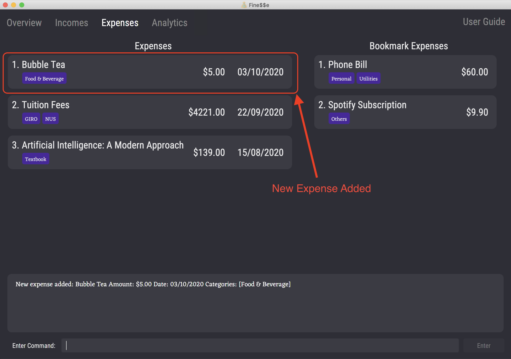
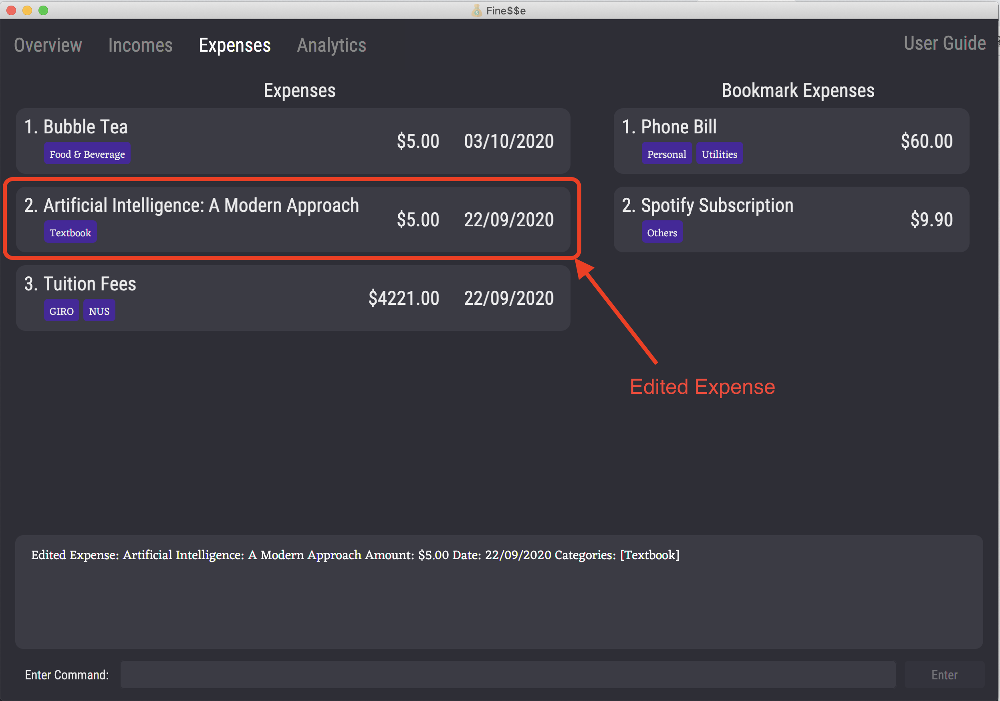
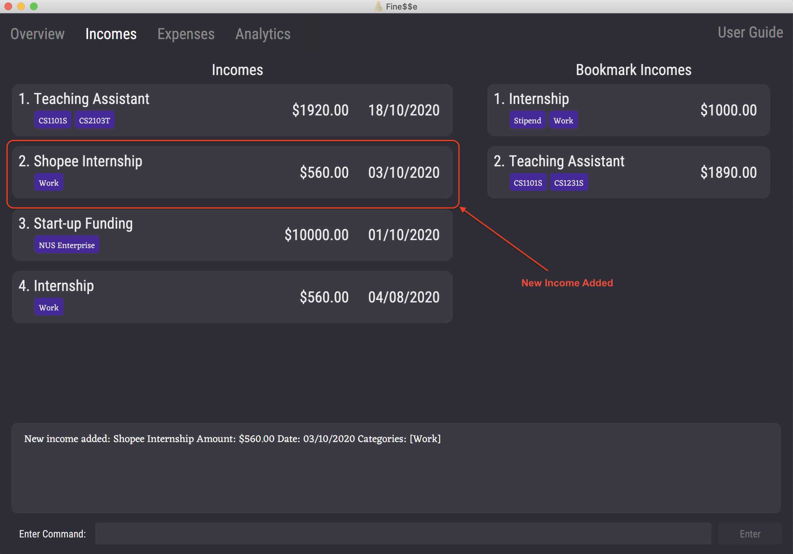
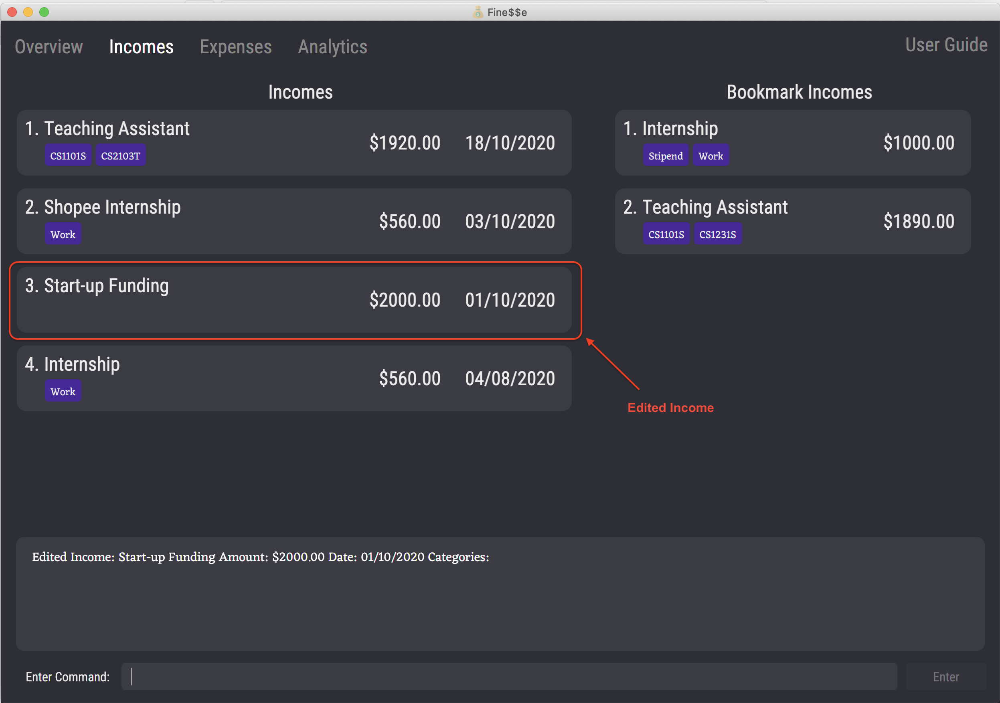
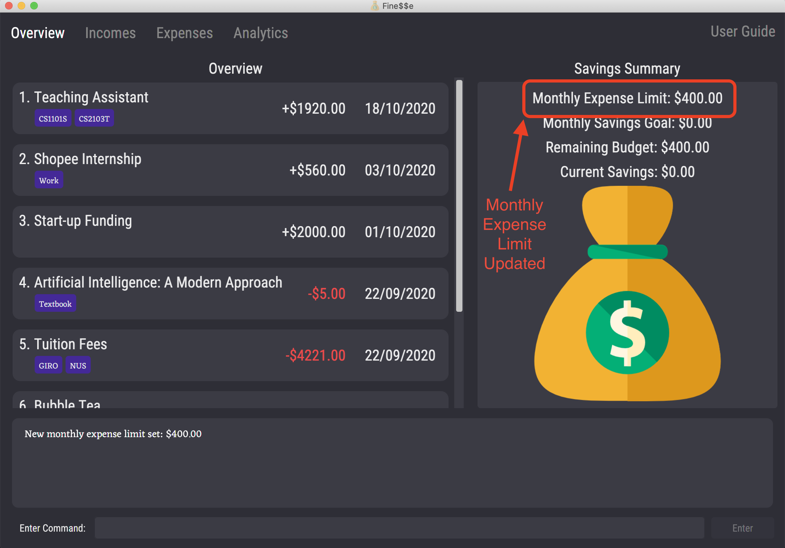
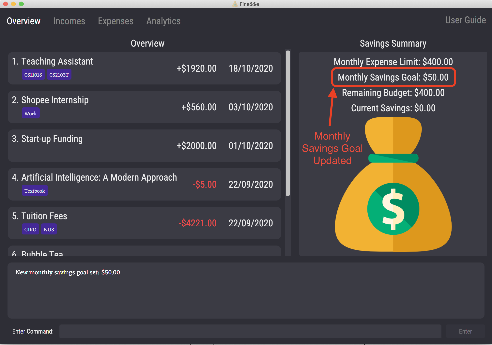

The aim of the User Guide is to provide you with all the necessary information required for you to fully utilize Fine$$e.
We have ensured that the information provided is concise, accessible and easily readable.

Explore our User Guide to find out more about Fine\$\$e’s amazing features.

<h3>Table of Contents</h3>

<div class="toc-no-bullet-points">
  * Table of Contents
  {:toc}
</div>

--------------------------------------------------------------------------------------------------------------------
## 1. Introduction

### 1.1 About Fine$$e

Welcome to Fine$$e - your personal finance tracker!

Looking for an all-in-one solution to help you develop good financial habits? Look no further!

Fine\\$\\$e (pronounced "finesse") is an integrated platform fully customized for university students with the aim of helping you track your finances with a few simple commands.
To help you cultivate good financial habits, Fine$$e also helps you budget effectively by setting an expense limit and savings goal, as well as viewing your past spending and saving trends.

Commands can be input easily via the Command Line Interface (CLI), and the information you provide Fine$$e with will be displayed on our sleek Graphical User Interface (GUI).

If you wish to better manage your finances while cultivating good financial habits, then Fine\$\$e is definitely the application for you!

### 1.2 Navigating the User Guide

Head to [Section 2. "Quick Start"](#2-quick-start) for help on setting up.

[Section 3. "Overview of Features"](#3-overview-of-features) provides a brief overview of Fine\$\$e's myriad of features, while [Section 4. "Features"](#4-features) contains an in-depth breakdown of all the features that Fine\$\$e has to offer.

If you have forgotten the input format for a particular command, fret not as [Section 5. "Command Summary"](#5-command-summary) contains a list of all Fine$$e's command input formats.

A list of the terms used in this user guide as well as their definitions is available in [Section 6. "Glossary"](#6-glossary).

If you have any questions regarding Fine$$e, do check out [Section 7. "Frequently Asked Questions (FAQ)"](#7-frequently-asked-questions-faq).

<div markdown="block" class="alert alert-info">

Do take note of the following symbols and formatting used throughout this document:

`Code in code blocks are for user input, Fine$$e data values, or file names.`

:bulb: &nbsp; This indicates useful tips and tricks.

:information_source: &nbsp; This indicates useful information.

:warning: &nbsp; This indicates important information.

</div>

--------------------------------------------------------------------------------------------------------------------
## 2. Quick Start

This section contains a step-by-step guide on how to install Fine\\$\\$e and get it to work on your computer.
It also introduces the various components that make up Fine\\$\\$e's user interface.

Let's get started!

### 2.1 Installation

1. Ensure you have Java 11 (or later versions) installed in your computer.

1. Download the latest version of `finesse.jar` from [here](https://github.com/AY2021S1-CS2103T-W16-3/tp/releases).

1. Copy the file to the folder you want to use as the *home folder* for Fine$$e.

1. Double-click the file to start the app.
The Fine$$e GUI should appear in a few seconds, with sample data included, similar to the below image.

   

1. Type a command in the command box and press "Enter" to execute it.<br>
   e.g. typing `help` and pressing "Enter" will bring up this user guide in the finance tracker.<br>
   Some example commands you can try:

   * `list`: Lists all transactions in the current list.

   * `add-expense t/Bubble Tea a/5 d/03/10/2020 c/Food & Beverage`:
   Adds an expense with the title `Bubble Tea`, amount `$5.00`, date `03/10/2020` and category `Food & Beverage` to the finance tracker. The UI switches to the [Expenses tab](#223-expenses-tab).

   * `tab 3`: Switches to the [Expenses tab](#223-expenses-tab).

   * `delete 3`: Deletes the 3rd transaction shown in the current list.
      Note that this command only works in the [Expenses tab](#223-expenses-tab) and the [Incomes tab](#222-incomes-tab).

   * `exit`: Exits the app.

1. Start tracking your own finances with Fine\\$\\$e!

### 2.2 Layout of Fine$$e's Interface

The user interface is divided into 4 tabs, each serving a specific purpose.

#### 2.2.1 Overview Tab

Displays a list of all recent transactions (both [incomes](#44-income) and [expenses](#43-expense)), along with your [expense limit](#47-expense-limit), [savings goal](#48-savings-goal), remaining budget and current savings.

> :information_source: &nbsp; [Incomes](#44-income) have a "+" in front of their amounts, while [expenses](#43-expense) have a "-" in front of their amounts and are highlighted in red.


{:.image-caption}
Layout of Overview tab

#### 2.2.2 Incomes Tab

Displays a list of [incomes](#44-income) and [bookmark incomes](#46-bookmark-income).


{:.image-caption}
Layout of Incomes tab

#### 2.2.3 Expenses Tab

Displays a list of [expenses](#43-expense) and [bookmark expenses](#45-bookmark-expense).


{:.image-caption}
Layout of Expenses tab

#### 2.2.4 Analytics Tab

Displays chart visualizations of your monthly expenses, incomes and savings.


{:.image-caption}
Layout of Analytics tab

--------------------------------------------------------------------------------------------------------------------

## 3. Overview of Features

This section will provide you with a brief overview of Fine\\$\\$e, so that you may get a better sense of Fine\\$\\$e’s basic functionalities before diving into its specific commands.
1.	Manage your transactions
  * Track transactions by entering their details e.g title, amount, date
  * Categorize transactions to better organize your finances
  * Search for transactions by keywords
1. Add bookmark transactions
  * Create templates for transactions that occur regularly so that frequent transactions can be added to the finance tracker more conveniently
1. Budgeting
  * Set a monthly expense limit to track your remaining budget for the current month
  * Set a monthly savings goal to help you cultivate good saving habits
1. Analytics
  * View trends in your finances to analyze your spending and saving habits and better plan for the future

--------------------------------------------------------------------------------------------------------------------

## 4. Features

This section aims to provide you with in-depth details of Fine\$\$e's unique features, with relevant examples.

<div markdown="block" class="alert alert-info">

**:information_source: &nbsp; Notes about the command format:**<br>

* Words in `UPPER_CASE` are the parameters to be supplied by the user.<br>
  e.g. in `add-expense t/TITLE`, `TITLE` is a parameter which can be used as `add t/Bubble Tea`.

* Items in square brackets (`[]`) are optional.<br>
  e.g `t/TITLE [c/CATEGORY]` can be used as `t/Bubble Tea c/Food & Beverage` or as `t/Bubble Tea`.

* Items in square brackets, with `...` after the parameter, can be used multiple times (including zero times).<br>
  e.g. `[c/CATEGORY...]` can be used as `c/Food & Beverage`, `c/Food & Beverage c/Tea` etc, or even omitted completely.

* Parameters can be in any order.<br>
  e.g. if the command specifies `t/TITLE a/AMOUNT`, `a/AMOUNT t/TITLE` is also acceptable.

</div>

<div markdown="block" class="alert alert-info">

**:warning: &nbsp; IMPORTANT &nbsp; :warning:**<br>

The formats of the parameters used in the rest of the document are as follows:
* `TITLE`, `TITLE_KEYPHRASE` and `CATEGORY` should consist of letters and/or numbers.
* `AMOUNT`, `AMOUNT_FROM` and `AMOUNT_TO` should each be a non-negative number with up to 8 digits before the decimal point and with 0 or 2 decimal places.
  An optional `$` may be included in front as well.
* `DATE`, `DATE_FROM` and `DATE_TO` should each be a valid calendar date in `dd/mm/yyyy` format, representing day, month, and year respectively.
  * For day and month values, single-digit values must be padded with leading zeroes, meaning that a value of 5 should be written as `05` instead of `5`.
  * For year values, it must be written in the standard 4-digit format, so 2019 should be written as `2019` and not just `19`.
  * Dates cannot be later than the current date.
* `INDEX` should be a positive integer.

Unless stated otherwise, only one input per parameter is allowed for each command.

Furthermore, within each command, any parameters other than the ones listed in each command format will be considered invalid.
The command will not be executed and an error message will be displayed.

</div>

### 4.1 View Help: `help`

Brings up the user guide.

Format: `help`

Example Usage:
```
help
```

Expected Outcome:
```
Opened help window.
```


{:.image-caption}
Help window containing the user guide

The user guide is shown in the application.

### 4.2 Switch Tabs: `tab`

Switches the current tab on Fine$$e.

Format: `tab INDEX`
* Switches to the tab corresponding to the specified `INDEX`. For the `tab` command, `INDEX` **must be 1, 2, 3 or 4**.
  * Index 1 switches to the [Overview tab](#221-overview-tab).
  * Index 2 switches to the [Incomes tab](#222-incomes-tab).
  * Index 3 switches to the [Expenses tab](#223-expenses-tab).
  * Index 4 switches to the [Analytics tab](#224-analytics-tab).

Example Usage:
```
tab 1
```

Expected Outcome:
```
Switched to overview tab.
```
The application switches to the Overview tab.

### 4.3 Expense

An **expense** represents you *paying money for something*.
It could be textbooks for the new semester, that cup of bubble tea you drank the other day, or even taking public transport.

To help you manage your finances, Fine\$\$e records the following information about each of your expenses:
1. **Title**: A descriptive title, to remind you what the expense was about.
1. **Amount**: How much money you paid, to calculate how much you have spent in total.
1. **Date**: The date the payment took place, to track your spending over periods of time.
1. **Categories**: Any number of categories, to help you group related expenses together.

#### 4.3.1 Add Expense: `add-expense`

Adds an expense to the finance tracker.

> :information_source: &nbsp; After executing this command, the UI will automatically switch to the [Expenses tab](#223-expenses-tab).

Format: `add-expense t/TITLE a/AMOUNT [d/DATE] [c/CATEGORY...]`

* `DATE` is optional. If `DATE` is not given, the current date is used.
* `CATEGORY` is optional. Multiple `c/` prefixes can be used to specify multiple categories.

Shortcuts: `adde`; (when on the [Expenses tab](#223-expenses-tab)) `add`

Examples:
* `add-expense t/Starbucks Coffee a/8.90 d/25/10/2020`
* `adde t/Taxi Home from School a/$13 c/Transport c/School`

Example Usage:
```
add-expense t/Bubble Tea a/5 d/03/10/2020 c/Food & Beverage
```

Expected Outcome:
```
New expense added: Bubble Tea Amount: $5.00 Date: 03/10/2020
Categories: [Food & Beverage]
```



{:.image-caption}
Expenses tab displaying the newly added expense

Adds a new expense titled `Bubble Tea`, with amount `$5.00`, date `03/10/2020`, and a single category `Food & Beverage`.

#### 4.3.2 Edit Expense: `edit`

Edits an expense in the finance tracker.

Format: (when on the [Expenses tab](#223-expenses-tab)) `edit INDEX [t/TITLE] [a/AMOUNT] [d/DATE] [c/CATEGORY...]`

* `INDEX` allows you to choose which expense to edit by specifying its position in the currently displayed expenses list.
* `TITLE`, `AMOUNT`, `DATE` and `CATEGORY` allow you to specify the expense information to update.
  * None of the above parameters are mandatory, but at least one must be specified.
  * If any `CATEGORY` is specified, it will replace all of the expense's categories.
  * For parameters that have been omitted, the value will remain unchanged.

> :bulb: &nbsp; To remove all categories from an expense, simply use `c/` with no category name following it.

Examples:
* `edit 1 t/Shopee Internship d/24/10/2020`
* `edit 3 a/$2000 c/`

Example Usage:
```
edit 2 a/5 d/22/09/2020
```

Expected Outcome:
```
Edited Expense: Artificial Intelligence: A Modern Approach Amount: $5.00
Date: 22/09/2020 Categories: [Textbook]
```



{:.image-caption}
Expenses tab displaying the edited expense

Edits the second expense in the currently displayed expenses list to have amount `$5.00` and date `22/09/2020`.
The rest of the expense information remains unchanged.

> :information_source: &nbsp; After executing this command, any filtering done on the expenses list via the `find` command will be reset, and the expenses list will display all expenses.

#### 4.3.3 Delete Expense: `delete`

Deletes the specified expense from the finance tracker.

Format: (when on the [Expenses tab](#223-expenses-tab)) `delete INDEX`

* `INDEX` allows you to choose which expense to delete by specifying its position in the currently displayed expenses list.

Example Usage:
```
delete 1
```

Expected Outcome:
```
Deleted Expense: Bubble Tea Amount: $5.00 Date: 22/09/2020
Categories: [Food & Beverage]
```
Deletes the first expense in the currently displayed expenses list.

#### 4.3.4 List Expense: `ls-expense`

Shows a list of all expenses in the finance tracker.
This effectively resets any current filtering of the expenses list, such as those made by `find`.

> :information_source: &nbsp; After executing this command, the UI will automatically switch to the [Expenses tab](#223-expenses-tab).

Format: `ls-expense`

Shortcuts: `lse`; (when on the [Expenses tab](#223-expenses-tab)) `list`

> :bulb: &nbsp; When on the [Overview tab](#221-overview-tab), you can use `list` to list all transactions.

Example Usage:
```
ls-expense
```

Expected Outcome:
```
Listed all expenses.
```
The finance tracker switches to the [Expenses tab](#223-expenses-tab) and lists all expenses.

#### 4.3.5 Find Expense: `find`

Finds expenses that match any of the given search parameters, and displays the list of matching expenses.

Format: (when on the [Expenses tab](#223-expenses-tab)) `find [t/TITLE_KEYPHRASE...] [a/AMOUNT] [d/DATE] [c/CATEGORY...] [af/AMOUNT_FROM] [at/AMOUNT_TO] [df/DATE_FROM] [dt/DATE_TO]`

> :bulb: &nbsp; When on the [Overview tab](#221-overview-tab), you can use `find` to search for all transactions.

The available search parameters and their uses are as follows:

* `t/TITLE_KEYPHRASE`: Searches for all expenses with titles containing the specified `TITLE_KEYPHRASE` keyphrase.
  * The search is case-insensitive. e.g. `t/taxi` will match `Taxi`.
  * A keyphrase can contain more than one word. e.g. `t/bubble tea` is considered as one keyphrase.
  * Titles matching at least one keyphrase will be returned.
    e.g. `t/Tea t/Coffee` will return the expenses that contains the words `tea` and/or `coffee`.
* `a/AMOUNT`: Searches for all expenses with the specified amount.
* `d/DATE`: Searches for all expenses that occurred on the specified date.
* `c/CATEGORY`: Searches for all expenses labelled with the specified category.
  * The search is case-insensitive. e.g. `taxi` will match `Taxi`.
  * More than one category can be given; the search will return expenses with any of the input categories.
* `af/AMOUNT_FROM`: Searches for all expenses with amounts more than or equal to the specified amount.
* `at/AMOUNT_TO`: Searches for all expenses with amounts less than or equal to the specified amount.
* `df/DATE_FROM`: Searches for all expenses that occurred on or after the specified date.
* `dt/DATE_TO`: Searches for all expenses that occurred on or before the specified date.

None of the search parameters are mandatory, but at least one must be specified.

Examples:
* `find t/tea d/22/09/2020`
* `find c/Food & Beverage af/10`

Example Usage:
```
find t/tea t/coffee a/5 df/01/09/2020 dt/30/09/2020
```

Expected Outcome:
```
2 transactions listed!
```
Lists all expenses with titles containing `tea` and/or `coffee`, with amount equal to `$5.00`, in September 2020.

### 4.4 Income

An **income** represents you *receiving money for something*.
It could be your internship allowance, prize money you won from a pitch competition, or even red packets that you received over Chinese New Year.

To help you manage your finances, Fine\$\$e records the following information about each of your incomes:
1. **Title**: A descriptive title, to remind you what the income was about.
1. **Amount**: How much money you received, to calculate how much you have received in total.
1. **Date**: The date you received the money, to track your income over periods of time.
1. **Categories**: Any number of categories, to help you group related incomes together.

#### 4.4.1 Add Income: `add-income`

Adds an income to the finance tracker.

> :information_source: &nbsp; After executing this command, the UI will automatically switch to the [Incomes tab](#222-incomes-tab).

Format: `add-income t/TITLE a/AMOUNT d/DATE [c/CATEGORY...]`

* `DATE` is optional. If `DATE` is not given, the current date is used.
* `CATEGORY` is optional. Multiple `c/` prefixes can be used to specify multiple categories.

Shortcuts: `addi`; (when on the [Incomes tab](#222-incomes-tab)) `add`

Examples:
* `add-income t/Waitressing a/80 c/Work`
* `addi t/Angpao money a/$20 d/25/01/2020 c/CNY c/Gift`

Example Usage:
```
add-income t/Shopee Internship a/560 d/03/10/2020 c/Work
```

Expected Outcome:
```
New income added: Shopee Internship Amount: $560.00 Date: 03/10/2020
Categories: [Work]
```



{:.image-caption}
Incomes tab displaying the newly added income

Adds a new income titled `Shopee Internship`, with amount `$560.00`, date `03/10/2020`, and a single category `Work`.

#### 4.4.2 Edit Income: `edit`

Edits an expense in the finance tracker.

Format: (when on the [Incomes tab](#222-incomes-tab)) `edit INDEX [t/TITLE] [a/AMOUNT] [d/DATE] [c/CATEGORY...]`

* `INDEX` allows you to choose which income to edit by specifying its position in the currently displayed incomes list.
* `TITLE`, `AMOUNT`, `DATE` and `CATEGORY` allow you to specify the updated income information.
  * None of them are mandatory, but at least one must be specified.
  * If any `CATEGORY` is specified, it will replace all of the income's existing categories.
  * For parameters that have been omitted, the value will remain unchanged.

> :bulb: &nbsp; To remove all categories from an income, simply use `c/` with no category name following it.

Examples:
* `edit 2 t/October Allowance c/Allowance`
* `edit 1 a/5 d/22/09/2020`

Example Usage:
```
edit 3 a/$2000 c/
```

Expected Outcome:
```
Edited Income: Start-up Funding Amount: $2000.00 Date: 01/10/2020 Categories:
```



{:.image-caption}
Incomes tab displaying the edited income

Edits the third income in the currently displayed incomes list to have amount `$2000.00` and no categories.
The rest of the income information remains unchanged.

> :information_source: &nbsp; After executing this command, any filtering done on the incomes list via the `find` command will be reset, and the incomes list will display all incomes.

#### 4.4.3 Delete Income: `delete`

Deletes the specified income from the finance tracker.

Format: (when on the [Incomes tab](#222-incomes-tab)) `delete INDEX`

* `INDEX` allows you to choose which income to delete by specifying its position in the currently displayed incomes list.

Example Usage:
```
delete 1
```

Expected Outcome:
```
Deleted Income: Teaching Assistant Amount: $1920.00 Date: 18/10/2020
Categories: [CS2103T][CS1101S]
```
Deletes the second income in the currently displayed incomes list.

#### 4.4.4 List Income: `ls-income`

Shows a list of all incomes in the finance tracker.
This effectively resets any current filtering of the incomes list, such as those made by `find`.

> :information_source: &nbsp; After executing this command, the UI will automatically switch to the [Incomes tab](#222-incomes-tab).

Format: `ls-income`

Shortcuts: `lsi`; (when on the [Incomes tab](#222-incomes-tab)) `list`

> :bulb: &nbsp; When on the [Overview tab](#221-overview-tab), you can use `list` to list all transactions.

Example Usage:
```
ls-income
```

Expected Outcome:
```
Listed all incomes.
```
The finance tracker switches to the [Incomes tab](#222-incomes-tab) and lists all incomes.

#### 4.4.5 Find Income: `find`

Finds incomes that match any of the given search parameters, and displays the list of matching incomes.

Format: (when on the [Incomes tab](#222-incomes-tab)) `find [t/TITLE_KEYPHRASE...] [a/AMOUNT] [d/DATE] [c/CATEGORY...] [af/AMOUNT_FROM] [at/AMOUNT_TO] [df/DATE_FROM] [dt/DATE_TO]`

> :bulb: &nbsp; When on the [Overview tab](#221-overview-tab), you can use `find` to search for all transactions (expenses and incomes).

The available search parameters and their uses are as follows:

* `t/TITLE_KEYPHRASE`: Searches for all incomes with titles containing the specified `TITLE_KEYPHRASE` keyphrase.
  * The search is case-insensitive. e.g. `t/work` will match `Work`.
  * A keyphrase can contain more than one word. e.g. `t/Shopee internship` is considered as one keyphrase.
  * Titles matching at least one keyphrase will be returned.
    e.g. `t/allowance t/prize` will return the incomes that contains the words `allowance` and/or `prize`.
* `a/AMOUNT`: Searches for all incomes with the specified amount.
* `d/DATE`: Searches for all incomes that occurred on the specified date.
* `c/CATEGORY`: Searches for all incomes labelled with the specified category.
  * The search is case-insensitive. e.g. `work` will match `Work`.
  * More than one category can be given; the search will return incomes with any of the input categories.
* `af/AMOUNT_FROM`: Searches for all incomes with amounts more than or equal to the specified amount.
* `at/AMOUNT_TO`: Searches for all incomes with amounts less than or equal to the specified amount.
* `df/DATE_FROM`: Searches for all incomes that occurred on or after the specified date.
* `dt/DATE_TO`: Searches for all incomes that occurred on or before the specified date.

None of the search parameters are mandatory, but at least one must be specified.

Examples:
* `find t/allowance d/01/10/2020`
* `find c/angpao at/20`

Example Usage:
```
find c/prize c/gift af/10 at/100
```

Expected Outcome:
```
2 transactions listed!
```
Lists all incomes with the category `prize` and/or `gift`, with amounts between `$10.00` and `$100.00` inclusive.

### 4.5 Bookmark Expense

A **bookmark expense** is a template that allows you to create expenses that you make frequently, such as paying phone bills monthly or buying bubble tea weekly.
You can convert a bookmark expense repeatedly to create as many expenses as you want, and the created expenses will automatically be added to Fine<span>$</span><span>$</span>e's expenses list.

To help you manage your finances, Fine\$\$e records the following information about each of your bookmark expenses:
1. **Title**: A descriptive title, to remind you what the bookmark expense is about.
1. **Amount**: How much money you would have spent each time you convert the bookmark expense into an expense.
1. **Categories**: Any number of categories, to help you group related bookmark expenses together.


{:.image-caption}
Bookmark expenses list panel in the Expenses tab

#### 4.5.1 Add Bookmark Expense: `add-bookmark-expense`

Adds a bookmark expense to the finance tracker.

> :information_source: &nbsp; After executing this command, the UI will automatically switch to the [Expenses tab](#223-expenses-tab).

Format: `add-bookmark-expense t/TITLE a/AMOUNT [c/CATEGORY...]`

Shortcut: `addbe t/TITLE a/AMOUNT [c/CATEGORY...]`

* `CATEGORY` is optional. Multiple `c/` prefixes can be used to specify multiple categories.

> :warning: &nbsp; Adding of duplicate bookmark expenses is not allowed.<br>
> Bookmark expenses with the same titles are considered to be duplicates of each other.

Examples:
* `add-bookmark-expense t/Phone Bill a/60 c/Utilities c/Personal`
* `add-bookmark-expense t/Spotify Subscription a/$9 c/Others`
* `addbe t/Bubble Tea a/$4.50 c/Food & Beverage`
* `addbe t/Lunch a/$5.00`

Example Usage:
```
add-bookmark-expense t/Netflix Subscription a/11.98 c/Entertainment
```

Expected Outcome:
```
New bookmark expense added: Netflix Subscription Amount: $11.98
Categories: [Entertainment]
```


{:.image-caption}
Bookmark expenses list panel displaying the newly added bookmark expense

Adds a bookmark expense titled `Netflix Subscription` with amount `$11.98` and one category `Entertainment`.

#### 4.5.2 Edit Bookmark Expense: `edit-bookmark`

Edits a bookmark expense in the finance tracker.

Format: (while on the [Expenses tab](#223-expenses-tab)) `edit-bookmark INDEX [t/TITLE] [a/AMOUNT] [c/CATEGORY...]`

* `INDEX` allows you to choose which bookmark expense to edit by specifying its position in the bookmark expenses list.
* `TITLE`, `AMOUNT` and `CATEGORY` allow you to specify the updated bookmark expense information.
  * None of them are mandatory, but at least one must be specified.
  * If any `CATEGORY` is specified, it will replace all of the bookmark expense's existing categories.
  * For parameters that have been omitted, the value will remain unchanged.

> :bulb: &nbsp; To remove all categories from a bookmark expense, simply use `c/` with no category name following it.

Examples:
* `edit-bookmark 1 a/65`
* `edit-bookmark 2 t/Part Time a/400 c/Work`
* `edit-bookmark 3 c/Others`

Example Usage:
```
edit-bookmark 3 a/15 c/Entertainment c/Personal
```

Expected Outcome:
```
Edited Bookmark Expense: Netflix Subscription Amount: $15.00
Categories: [Entertainment][Personal]
```


{:.image-caption}
Bookmark expenses list panel displaying the edited bookmark expense

Edits the third bookmark expense in the bookmark expenses list to have an amount of `$15.00` and two categories `Entertainment` and `Personal`.

#### 4.5.3 Delete Bookmark Expense: `delete-bookmark`

Deletes the specified bookmark expense from the finance tracker.

Format: (while on the [Expenses tab](#223-expenses-tab)) `delete-bookmark INDEX`

* `INDEX` allows you to choose which bookmark expense to delete by specifying its position in the bookmark expenses list.

Expected Outcome:
```
Deleted Bookmark Expense: Phone Bill Amount: $60.00 Categories: [Utilities]
```
Deletes the third bookmark expense in the bookmark expenses list.

#### 4.5.4 Convert Bookmark Expense: `convert-bookmark`

Converts a bookmark expense into an expense, and adds it to the expenses list.

Format: (while on the [Expenses tab](#223-expenses-tab)) `convert-bookmark INDEX [d/DATE]`

Shortcut: `convertb INDEX [d/DATE]`

* `INDEX` allows you to choose which bookmark expense to convert by specifying its position in the bookmark expenses list.
* `DATE` is optional. If `DATE` is not specified, the current date is used.

Examples:
* `convert-bookmark 2 d/10/10/2020`
* `convertb 1 d/05/05/2020`

Example Usage:
```
convert-bookmark 3 d/10/08/2020
```

Expected Outcome:
```
Bookmark expense has been converted and successfully added to finance tracker:
Netflix Subscription Amount: $15.00 Date: 10/08/2020
Categories: [Entertainment][Personal]
```


{:.image-caption}
Expenses tab displaying the newly added expense converted from the bookmark expense

Converts the third bookmark expense in the bookmark expenses list into an expense with the same information as the
specified bookmark expense, and date `10/08/2020`, and adds it to the expenses list in the finance tracker.

### 4.6 Bookmark Income

A **bookmark income** is a template that allows you to create incomes that you make frequently, such as your monthly salary or stipend for being a teaching assistant.
You can convert a bookmark income repeatedly to create as many incomes as you want, and the created incomes will automatically be added to Fine<span>$</span><span>$</span>e's incomes list.

To help you manage your finances, Fine\$\$e records the following information about each of your bookmark incomes:
1. **Title**: A descriptive title, to remind you what the bookmark income is about.
1. **Amount**: How much money you would have received each time you convert the bookmark income into an income.
1. **Categories**: Any number of categories, to help you group related bookmark incomes together.


{:.image-caption}
Bookmark incomes list panel in the Incomes tab

#### 4.6.1 Add Bookmark Income: `add-bookmark-income`

Adds a bookmark income to the finance tracker.

> :information_source: &nbsp; After executing this command, the UI will automatically switch to the [Incomes tab](#222-incomes-tab).

Format: `add-bookmark-income t/TITLE a/AMOUNT [c/CATEGORY...]`

Shortcut: `addbi t/TITLE a/AMOUNT [c/CATEGORY...]`

* `CATEGORY` is optional. Multiple `c/` prefixes can be used to specify multiple categories.

> :warning: &nbsp; Adding of duplicate bookmark incomes is not allowed.<br>
> Bookmark incomes with the same titles are considered to be duplicates of each other.

Examples:
* `add-bookmark-income t/Internship a/$1000 c/Work`
* `add-bookmark-income t/Part Time a/450 c/Work c/Startup`
* `addbi t/Investments a/400 c/Personal c/Dividends`
* `addbi t/Monthly Allowance a/300`

Example Usage:
```
add-bookmark-income t/Part Time a/400 c/Work
```

Expected Outcome:
```
New bookmark income added: Part Time Amount: $400.00 Categories: [Work]
```


{:.image-caption}
Bookmark incomes list panel displaying the newly added bookmark income

Adds a bookmark income titled `Part Time` with amount `$400.00` and one category `Work`.

#### 4.6.2 Edit Bookmark Income: `edit-bookmark`

Edits a bookmark income in the finance tracker.

Format: (while on the [Incomes tab](#222-incomes-tab)) `edit-bookmark INDEX [t/TITLE] [a/AMOUNT] [c/CATEGORY...]`

* `INDEX` allows you to choose which bookmark income to edit by specifying its position in the bookmark incomes list.
* `TITLE`, `AMOUNT` and `CATEGORY` allow you to specify the updated bookmark income information.<br>
  * None of them are mandatory, but at least one must be specified.<br>
  * If any `CATEGORY` is specified, it will replace all of the bookmark income's existing categories.<br>
  * For parameters that have been omitted, the value will remain unchanged.<br>

> :bulb: &nbsp; To remove all categories from a bookmark income, simply use `c/` with no category name following it.

Examples:
* `edit-bookmark 1 t/Monthly Tuition c/Work c/Part Time`
* `edit-bookmark 2 a/1200`
* `edit-bookmark 3 t/Investments a/$300.00`

Example Usage:
```
edit-bookmark 3 a/500 c/Work c/Part Time Intern
```

Expected Outcome:
```
Edited Bookmark Income: Part Time Amount: $500.00 Categories: [Work][Part Time Intern]
```


{:.image-caption}
Bookmark incomes list panel displaying the edited bookmark income

Edits the third bookmark income in the bookmark incomes list to have an amount of `$500.00` and two categories `Work` and `Part Time Intern`.

#### 4.6.3 Delete Bookmark Income: `delete-bookmark`

Deletes the bookmark income and all of its information from the bookmark income list in Fine$$e.

Format: (while on the [Incomes tab](#222-incomes-tab)) `delete-bookmark INDEX`

* `INDEX` allows you to choose which bookmark income to delete by specifying its position in the bookmark incomes list.

Example Usage:
```
delete-bookmark 2
```

Expected Outcome:
```
Deleted Bookmark Income: Teaching Assistant Amount: $1890.00
Categories: [CS1101S][CS1231S]
```
Deletes the second bookmark expense in the bookmark incomes list.

#### 4.6.4 Convert Bookmark Income: `convert-bookmark`

Converts a bookmark income into an income, and adds it to the incomes list.

Format: (while on the [Incomes tab](#222-incomes-tab)) `convert-bookmark INDEX [d/DATE]`

Shortcut: `convertb INDEX [d/DATE]`

* `INDEX` refers to the index number of the bookmark income shown in the bookmark incomes list.
* `DATE` is optional. If `DATE` is not specified, the current date is used.

Examples:
* `convert-bookmark 1 d/10/10/2020`
* `convertb 2 d/15/10/2020`

Example Usage:
```
convert-bookmark 3 d/03/08/2020
```

Expected Outcome:
```
Bookmark income has been converted and successfully added to finance tracker:
Part Time Amount: $500.00 Date: 03/08/2020 Categories: [Work][Part Time Intern]
```


{:.image-caption}
Incomes tab displaying the newly added income converted from the bookmark income

Converts the third bookmark income in the bookmark incomes list into an income with the same information as the
specified bookmark income, and date `03/08/2020`, then adds it to the incomes list in the finance tracker.

### 4.7 Expense Limit

Ever feel like your wallet just won't stop bleeding? Try setting a monthly expense limit!
The expense limit feature allows you to limit your spending by setting a budget for the month.
The monthly expense limit is visible on the [Overview tab](#221-overview-tab) along with your remaining budget for this month, which is automatically calculated based on the expenses in the finance tracker.

#### 4.7.1 Set Expense Limit: `set-expense-limit`

Sets the monthly expense limit in the finance tracker.

> :information_source: &nbsp; After executing this command, the UI will automatically switch to the [Overview tab](#221-overview-tab).

Format: `set-expense-limit a/AMOUNT`

Shortcut: `setel a/AMOUNT`

Example:
* `set-expense-limit a/500`

Example Usage:
```
setel a/$400.00
```

Expected Outcome:
```
New monthly expense limit set: $400.00
```



{:.image-caption}
Overview tab displaying the new expense limit

Sets the monthly expense limit in the finance tracker to be `$400.00`.

### 4.8 Savings Goal

Want to save up for the new PlayStation 5 but can't seem to no matter what? Fine$$e has you covered!
The savings goal feature allows you to save consistently by setting a monthly savings goal, so that you can save up bit by bit and build good financial habits.
The monthly savings goal is visible on the [Overview tab](#221-overview-tab) along with your current savings for this month, which is automatically calculated based on the expenses and incomes in the finance tracker.

#### 4.8.1 Set Savings Goal: `set-savings-goal`

Sets the monthly savings goal in the finance tracker.

> :information_source: &nbsp; After executing this command, the UI will automatically switch to the [Overview tab](#221-overview-tab).

Format: `set-savings-goal a/AMOUNT`

Shortcut: `setsg a/AMOUNT`

Example:
* `set-savings-goal a/100`

Example Usage:
```
setsg a/$50.00
```

Expected Outcome:
```
New monthly savings goal set: $50.00
```



{:.image-caption}
Overview tab displaying the new savings goal

Sets the monthly savings goal in the finance tracker to be `$50.00`.

### 4.9 Analytics

Want to see your spending/saving trends?
The analytics feature will allow you to view a variety of trends based on the transactions you have entered into the finance tracker.
These analytics will give you a better overview of your transactions and help you better understand them, so that you can make targeted changes to your habits if need be.

There are three bar charts that show the following data over the past three months:
* Total monthly expenses
* Total monthly incomes
* Total monthly savings

Whenever you switch to the [Analytics tab](#224-analytics-tab), the data in the bar charts is automatically updated to include any recent modifications you have made in the finance tracker.
This ensures that you will always see the latest information about your spending and saving trends.

### 4.10 Clear Data: `clear`

Ready to start using Fine\\$\\$e after fiddling with the sample data? Want to start over your finance tracking journey on a clean slate?
This command allows you to clear *all* existing data inside the finance tracker. That includes:
* Expenses and incomes
* Bookmark expenses and bookmark incomes
* Monthly expense limit
* Monthly savings goal

Format: `clear`

> :warning: &nbsp; This is a powerful command. You might lose your precious data if you are not careful with it.

> :bulb: &nbsp; If there is any data you would like to keep before clearing, save it somewhere so that you can re-enter it later.

To protect against accidental usage, this command needs to be entered **twice in succession** before it takes effect.
A single `clear` command is nullified when not followed by another `clear` command.

Here are some example scenarios to illustrate:
* Scenario A: Enter `clear`, then enter `clear` again.
  * The finance tracker data is cleared.
* Scenario B: Enter `clear`, then enter `lsi` (a command), then enter `clear` again.
  * The finance tracker data is unchanged.
  * The first `clear` command has been nullified, so Fine\\$\\$e requests for a second `clear` command as confirmation.
* Scenario C: Enter `clear`, then enter `lsi`, then enter `clear` again, then enter `clear` yet again.
  * The finance tracker data is cleared.

Example Usage:
```
clear
```

Expected Outcome:
```
Please enter 'clear' again to confirm your decision.
```

Example Usage (continued):
```
clear
```

Expected Outcome:
```
Finance tracker has been cleared!
```
All data in the finance tracker is cleared.

### 4.11 Exit the Program: `exit`

Exits the program.

Format: `exit`

### 4.12 Command History

Accidentally entered the wrong command and wish to modify it without typing it out again fully?
Simply press the ↑ or ↓ arrow keys on your keyboard to navigate through your command history.

* The command history keeps track of the latest 50 commands entered in the current session.
* Press the ↑ arrow key to retrieve the previous commands.
  * Each press of the ↑ arrow key retrieves the command immediately preceding the current command.
  * If the current command is the earliest command that is being tracked, then pressing the ↑ arrow key does nothing.
* Press the ↓ arrow key to retrieve the next commands.
  * Each press of the ↓ arrow key retrieves the command immediately succeeding the current command.
  * If the current command is the latest command that has been entered, then the command input box will be cleared upon pressing the ↓ arrow key.

> :warning: &nbsp; Pressing either the ↑ or ↓ arrow keys will cause whatever text is currently in the command input box to be overwritten.

### 4.13 Saving the Data

Fine$$e data is saved in the hard disk automatically after closing the application.
There is no need to save manually.

--------------------------------------------------------------------------------------------------------------------

## 5. Command Summary

Action | Format | Examples
------|------|--------
Add Expense | `add-expense t/TITLE a/AMOUNT [d/DATE] [c/CATEGORY...]` | `add-expense t/Bubble Tea a/5 d/03/10/2020 c/Food & Beverage` |
^^ &nbsp; | `adde t/TITLE a/AMOUNT [d/DATE] [c/CATEGORY...]` | `adde t/Taxi Home from School a/$13.50 d/10/10/2020 c/Transport c/School` |
^^ &nbsp; | (On [Expenses tab](#223-expenses-tab)) `add t/TITLE a/AMOUNT [d/DATE] [c/CATEGORY...]` | (On [Expenses tab](#223-expenses-tab)) `add t/Headphones a/$299.99 d/11/11/2020 c/Sale`
Add Income | `add-income t/TITLE a/AMOUNT [d/DATE] [c/CATEGORY...]` | `add-income t/Internship a/560 d/03/10/2020 c/Work` |
^^ &nbsp; | `addi t/TITLE a/AMOUNT [d/DATE] [c/CATEGORY...]` | `addi t/Angpao money a/$20 d/10/10/2020 c/CNY c/Gift` |
^^ &nbsp; | (On [Incomes tab](#222-incomes-tab)) `add t/TITLE a/AMOUNT [d/DATE] [c/CATEGORY...]` | (On [Incomes tab](#222-incomes-tab)) `add t/October Allowance a/$500 c/Allowance`
List Expenses | `ls-expense` <br> `lse` <br> (On [Expenses tab](#223-expenses-tab)) `list` | NA
List Incomes | `ls-income` <br> `lsi` <br> (On [Incomes tab](#222-incomes-tab)) `list` | NA
Find | `find [t/TITLE_KEYPHRASE...] [a/AMOUNT] [d/DATE] [c/CATEGORY...] [af/AMOUNT_FROM] [at/AMOUNT_TO] [df/DATE_FROM] [dt/DATE_TO]` | `find c/Food & drink af/10`
Edit | `edit INDEX [t/TITLE] [a/AMOUNT] [d/DATE] [c/CATEGORY...]`| `edit 1 t/Brunch d/22/09/2020` <br> `edit 2 a/500 c/`
Delete | `delete INDEX` | `delete 1`
Add Bookmark Expense | `add-bookmark-expense t/TITLE a/AMOUNT [c/CATEGORY...]` | `add-bookmark-expense t/Phone Bill a/60 c/Utilities c/Personal` |
^^ &nbsp; | `addbe t/TITLE a/AMOUNT [c/CATEGORY...]` | `addbe t/Bubble Tea a/$4.50 c/Food & Beverage`
Add Bookmark Income | `add-bookmark-income t/TITLE a/AMOUNT [c/CATEGORY...]` | `add-bookmark-income t/Internship a/$1000 c/Work` |
^^ &nbsp; | `addbi t/TITLE a/AMOUNT [c/CATEGORY...]` | `addbi t/Investments a/400 c/Personal c/Dividends`
Edit Bookmark | `edit-bookmark INDEX [t/TITLE] [a/AMOUNT] [c/CATEGORY...]`| `edit-bookmark 1 t/Monthly Tuition c/Work c/Part Time`
Delete Bookmark | `delete-bookmark INDEX` | `delete-bookmark 2`
Convert Bookmark | `convert-bookmark INDEX [d/DATE]` <br> `convertb INDEX [d/DATE]` | `convert-bookmark 2 d/10/10/2020`
Set Expense Limit | `set-expense-limit a/AMOUNT` | `set-expense-limit a/500` |
^^ &nbsp; | `setel a/AMOUNT` | `setel a/$400.00`
Set Savings Goal | `set-savings-goal a/AMOUNT` | `set-savings-goal a/100` |
^^ &nbsp; | `setsg a/AMOUNT` | `setsg a/$50.00`
Tab | `tab INDEX` | `tab 2`
Help | `help` | NA
Exit | `exit` | NA

--------------------------------------------------------------------------------------------------------------------

## 6. Glossary

Term | Definition
-----|-----------
Bookmark Expense | A template for an expense, which can be used to create expenses that are added to the finance tracker.
Bookmark Income | A template for an income, which can be used to create incomes that are added to the finance tracker.
Current Date | The system date on the computer on which Fine$$e is set up.
Expense | A one-time transaction that results in a decrease in the amount of money you have.
Income | A one-time transaction that results in an increase in the amount of money you have.
Text Cursor | A blinking vertical line that indicates where text will be placed when entered.

--------------------------------------------------------------------------------------------------------------------

## 7. Frequently Asked Questions (FAQ)

**Q**: How do I transfer my data to another computer?

**A**: Install the app on the other computer and overwrite the empty data file it creates with the file that contains the data of your previous Fine$$e finance tracker in the home folder.

**Q**: What happens if I change the system date in my computer?

**A**: Fine\\$\\$e has a system to automatically detect if your system time has changed. If Fine$$e detects a system time change, it will prevent you from making any changes to the data so as to protect your data from being corrupted.

**Q**: What should I do if I encounter an error that I cannot fix?

**A**: You may contact us via [ay2021s1-cs2103t-w16-3@googlegroups.com](ay2021s1-cs2103t-w16-3@googlegroups.com), and we will do our best to help you out.
