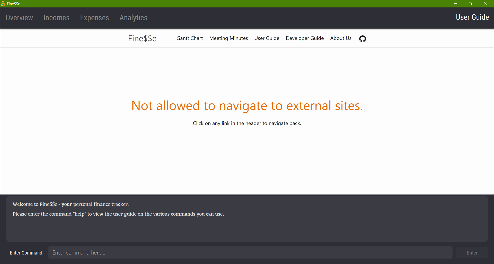

## Project: Fine$$e

### Overview

Fine$$e is a desktop finance tracker that allows tertiary students to better manage their finances, cultivating good financial habits such as saving. It is optimised for CLI users so that expenses and income can be tracked efficiently by typing in commands. It is written in Java, and has a GUI created with JavaFX.

### Summary of Contributions

* **New feature**: Embedded user guide within the application.
  * What it does: Allows the user to view the [user guide](UserGuide.html) from within the application.
  * Justification: The barriers to entry of using Fine\$\$e are high for new users as they are required to learn the various commands available.
  By embedding the user guide within the application, it allows users to quickly look up Fine$$e's features and their corresponding commands.
  This leads to a much better user experience.
  * Highlights: JavaFX's `WebView` component was used to display the user guide.
  Unfortunately, it does not adhere too closely to modern browser standards, resulting in certain pages not being rendered correctly.
  In order to ensure that the user experience is smooth, the decision to only allow users to access pages in the domain `https://ay2021s1-cs2103t-w16-3.github.io/tp/` was made.
  Should the user attempt to navigate to an external site, the following page is shown instead:
    

* **New feature**: Added command history.
  * What it does: Allows the user to cycle through their 50 most recent inputs via the ↑ and ↓ arrow keys.
  * Justification: Almost all modern command line interfaces support the scrolling through of previously typed commands.
  The addition of this feature allows users who are experienced with command line interfaces to be more efficent when using Fine$$e.
  * Highlights: This feature necessitated the implementation of a stack with a maximum capacity so as not to run out of memory.
  Once the stack is full, the bottom-most element of the stack is evicted.
  The underlying data structure that backs the stack is a doubly linked list.

* **Code contributed**: [RepoSense link](https://nus-cs2103-ay2021s1.github.io/tp-dashboard/#breakdown=true&search=&sort=groupTitle&sortWithin=title&since=2020-08-14&timeframe=commit&mergegroup=&groupSelect=groupByRepos&checkedFileTypes=docs~functional-code~test-code~other&tabOpen=true&tabType=authorship&tabAuthor=ianyong&tabRepo=AY2021S1-CS2103T-W16-3%2Ftp%5Bmaster%5D&authorshipIsMergeGroup=false&authorshipFileTypes=docs~functional-code~test-code~other)

* **Project management**:
  * Updated GitHub Pages to display meeting minutes and Gantt chart.

* **Enhancements to existing features**:
  * Refactored the user interface to be more extensible. (Pull request [#161](https://github.com/AY2021S1-CS2103T-W16-3/tp/pull/161))
  * Updated the user interface to be resizable and scalable. (Pull requests [#174](https://github.com/AY2021S1-CS2103T-W16-3/tp/pull/174), [#226](https://github.com/AY2021S1-CS2103T-W16-3/tp/pull/226))

* **Documentation**:
  * User Guide (Pull requests [#179](https://github.com/AY2021S1-CS2103T-W16-3/tp/pull/179), [#235](https://github.com/AY2021S1-CS2103T-W16-3/tp/pull/235)):
    * Updated user guide to give an overview of the various tabs in Fine$$e.
    * Added section on command history.
  * Developer Guide (Pull requests [#141](https://github.com/AY2021S1-CS2103T-W16-3/tp/pull/141), [#318](https://github.com/AY2021S1-CS2103T-W16-3/tp/pull/318)):
    * Added implementation details for tab switching.
    * Added implementation details for command history.
    * Added implementation details for data integrity safeguards.
    * Updated design details for UI component.

* **Community**:
  * PRs reviewed (with non-trivial review comments): [#39](https://github.com/AY2021S1-CS2103T-W16-3/tp/pull/39), [#75](https://github.com/AY2021S1-CS2103T-W16-3/tp/pull/75), [#123](https://github.com/AY2021S1-CS2103T-W16-3/tp/pull/123), [#232](https://github.com/AY2021S1-CS2103T-W16-3/tp/pull/232), [#264](https://github.com/AY2021S1-CS2103T-W16-3/tp/pull/264), [#265](https://github.com/AY2021S1-CS2103T-W16-3/tp/pull/265), [#285](https://github.com/AY2021S1-CS2103T-W16-3/tp/pull/285)
  * Helped classmates in forum discussions. (Examples: [1](https://github.com/nus-cs2103-AY2021S1/forum/issues/14), [2](https://github.com/nus-cs2103-AY2021S1/forum/issues/117), [3](https://github.com/nus-cs2103-AY2021S1/forum/issues/191), [4](https://github.com/nus-cs2103-AY2021S1/forum/issues/200), [5](https://github.com/nus-cs2103-AY2021S1/forum/issues/249), [6](https://github.com/nus-cs2103-AY2021S1/forum/issues/262), [7](https://github.com/nus-cs2103-AY2021S1/forum/issues/269), [8](https://github.com/nus-cs2103-AY2021S1/forum/issues/276), [9](https://github.com/nus-cs2103-AY2021S1/forum/issues/386))
  * Solution for removing bullet points from the table of contents of user guide was [adopted by several other classmates](https://github.com/nus-cs2103-AY2021S1/forum/issues/361).

* **Tools**:
  * Added Git pre-push hook to enforce code quality. (Pull request [#7](https://github.com/AY2021S1-CS2103T-W16-3/tp/pull/7))
  * Updated GitHub Pages build process to use `jekyll-spaceship` for greater control over site formatting. (Pull request [#18](https://github.com/AY2021S1-CS2103T-W16-3/tp/pull/18))
